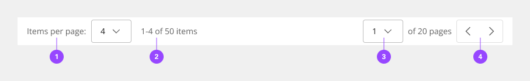
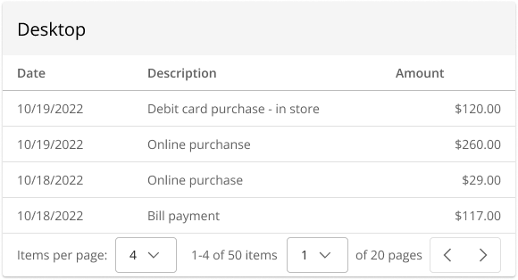
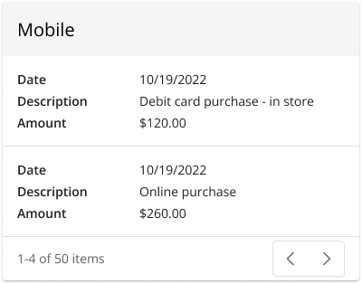
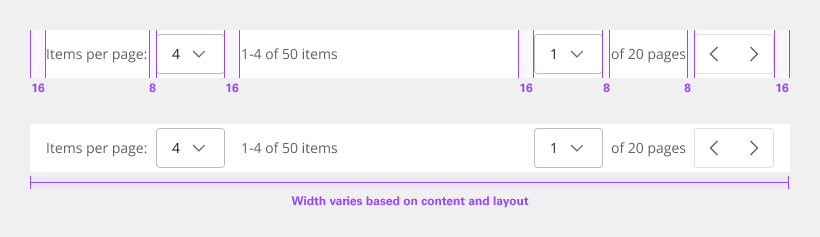
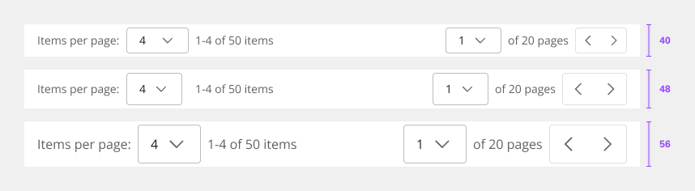

**[Back](components.md)** | **[Storybook](https://dev.dxo.ondotcloud.com/storybook-static/index.html?path=/story/pixel-components-pagination--paginaiton-d)**

# Pagination

Pagination is used for splitting up content or data into several pages, with a control for navigating to the next or previous page. Generally, pagination is used if there are more than 25 items displayed in one view. The default number displayed will vary depending on the context.

## Usage

### When to use

- The user is viewing a high level of content in a data table or contained list.
- Showing multiple screens in one card/title (e.g. data visualization or marketing banners).

### Anatomy

1. Items per page
2. Number of items shown
3. Current page viewing
4. Toggle navigation

### Identify the current page

Clearly identify which page the user is on by displaying the current page number. By providing context into how many pages there are in total (e.g. 1 of 4 pages), you can help provide clarity around the data displayed.

### Provide various options for navigating

Previous and next chevrons or links are the most useful way for the user to move forward or backward through pages of data. Provide an inline select in which users can choose the page they wish to navigate to.

### Items per page

Use an inline select within the pagination bar so the user can change the amount of data displayed per page.

## Style

Below is the token architecture color build of the components. The token can be changed or defined through the token mapping script that has been placed in the application repository.

**Pagination bar**

| State                      | Element                    | Property                   | Token name                 |
| :------------------------- | :------------------------- | :------------------------- | :------------------------- |
| Enabled                    | Container                  | Background Color           | `$layer_1`                 |
|                            |                            | Border Color               | `$border_subtle_1`         | 
|                            |                            | Box Shadow                 |                            | 
|                            | Label                      | Text Color                 | `$text_secondary`          |
|                            | Value                      | Text Color                 | `$text_primary`            |
|                            | Icon                       | SVG Color                  | `$secondary_secondary`     |

Dropdowns

**Dropdown**

| State                      | Element                    | Property                   | Token name                 |
| :------------------------- | :------------------------- | :------------------------- | :------------------------- |
| Enabled                    | Container                  | Background Color           | `$field_1`                 |
|                            |                            | Border Color               | `$border_strong_1`         |  
|                            | Label                      | Text Color                 | `$text_secondary`          |
|                            | Value                      | Text Color                 | `$text_primary`            |
|                            | Placeholder                | Text Color                 | `$text_placeholder`        |
|                            | Help Text                  | Text Color                 | `$text_secondary`          |
|                            | Icon                       | SVG Color                  | `$icon_secondary`          |
| Focus                      | Container                  | Background Color           | `$focus_highlight`         |
|                            |                            | Border Color               | `$focus`                   |  
|                            | Label                      | Text Color                 | `$text_secondary`          |
|                            | Value                      | Text Color                 | `$text_primary`            |
|                            | Placeholder                | Text Color                 | `$text_placeholder`        |
|                            | Help Text                  | Text Color                 | `$text_secondary`          |
|                            | Icon                       | SVG Color                  | `$icon_secondary`          |
| Disabled                   | Container                  | Background Color           | `$field_disabled_1`        |
|                            |                            | Border Color               | `$border_disabled_1`       |  
|                            | Label                      | Text Color                 | `$text_disabled`           |
|                            | Value                      | Text Color                 | `$text_disabled`           |
|                            | Placeholder                | Text Color                 | `$text_placeholder`        |
|                            | Help Text                  | Text Color                 | `$text_disabled`           |
|                            | Icon                       | SVG Color                  | `$icon_disabled`           |

**Button Group**

| State                      | Element                    | Property                   | Token name                 |
| :------------------------- | :------------------------- | :------------------------- | :------------------------- |
| Enabled                    | Container                  | Background Color           | `$layer_1`                 |
|                            |                            | Border Color               | `$border_subtle_1`         |  
|                            | Label                      | Text Color                 | `$text_secondary`          |
|                            | Icon                       | SVG Color                  | `$icon_secondary`          |
| Hover                      | Container                  | Background Color           | `$layer_hover_1`           |
|                            |                            | Border Color               | `$border_subtle_1`         |  
|                            | Label                      | Text Color                 | `$text_primary`            |
|                            | Icon                       | SVG Color                  | `$icon_primary`            |
| Selected                   | Container                  | Background Color           | `$layer_selected_1`        |
|                            |                            | Border Color               |                            |  
|                            | Label                      | Text Color                 | `$text_on_color`           |
|                            | Icon                       | SVG Color                  | `$icon_on_color`           |
| Focus                      | Container                  | Background Color           | `$focus_highlight`         |
|                            |                            | Border Color               | `$focus`                   |  
|                            | Label                      | Text Color                 | `$text_primary`            |
|                            | Icon                       | SVG Color                  | `$icon_primary`            |
| Disabled                   | Container                  | Background Color           | `$layer_disabled_1`        |
|                            |                            | Border Color               | `$border_subtle_1`         |  
|                            | Label                      | Text Color                 | `$text_disabled`           |
|                            | Icon                       | SVG Color                  | `$icon_disabled`           |

### Typography

Pagination text should be set in sentence case with the first letter of each word capitalized.

| Size                  | Font size | Font weight             | Token name                 |
| :-------------------- | :-------- | :---------------------- | :------------------------- | 
| Large                 | 16px      | 400 regular             | `$button_2_regular`        |
| Medium                | 14px      | 400 regular             | `$button_1_regular`        |
| Small                 | 14px      | 400 regular             | `$button_1_regular`        |

### Token architecture

| Token name                  | Description                                            |
| :-------------------------- | :----------------------------------------------------- |
| `$pagination_small`         | Defines height for the **small** variant.              |
| `$pagination_medium`        | Defines height for the **medium** variant.             |
| `$pagination_large`         | Defines height for the **large** variant.              |
| `$pagination_padding`       | Defines **padding** for the component.                 |
| `$pagination_margin`        | Defines **margin** for the component.                  |
| `$pagination_border`        | Defines **border** weight for the accordion component. |
| `$pagination_border_radius` | Defines **border radius** for the component.           |

### Structure

The Pagination bar is most commonly used in data tables. The width can vary depending on content and layout but should span the entire width of the table it’s being paired with.

**Pagination bar**

| Element               | Property                | Size      | Token name                  |
| :-------------------- | :---------------------- | :-------- | :-------------------------- |
| Container             | Padding Right x Left    | 16px      | `$pagination_padding`       |
|                       | Border Top              | 1px       | `$pagination_border`        |

**Button Group**

| Variant               | Property                | Size      | Token name                       |
| :-------------------- | :---------------------- | :-------- | :------------------------------- |
| Icon only             | Padding Right x Left    |           |                                  |
|                       | Border                  | 1px       | `$content_switcher_border`       |
|                       | Border Radius           | 4px       | `$content_switcher_border_radius`|

**Dropdown**

| Element               | Property                | Size      | Token name                  |
| :-------------------- | :---------------------- | :-------- | :-------------------------- |
| Input                 | Padding Right x Left    | 16px      | `$dropdown_padding`         |
|                       | Border                  | 1px       | `$dropdown_border`          |
|                       | Border Radius           | 4px       | `$dropdown_border_radius`   |
| Icon                  | Margin Left             | 8px       | `$dropdown_margin`          |
| Label                 | Margin Bottom           | 2px       | `$spacing_2`                |
| Helper Text           | Margin Top              | 2px       | `$spacing_2`                |

### Sizing

| Variant               | Element                 | Size               | Token name                 |
| :-------------------- | :---------------------- | :----------------- | :------------------------- |
| Small                 | Pagination bar          | (min-height:40px)  | `$pagination_small`        |
|                       | Dropdown                | 32px               | `$dropdown_small`          |
|                       | Button Group            | 32px               | `$content_switcher_small`  |
| Medium                | Pagination bar          | (min-height:48px)  | `$pagination_medium`       |
|                       | Dropdown                | 40px               | `$dropdown_medium`         |
|                       | Button Group            | 40px               | `$content_switcher_medium` |
| Large                 | Pagination bar          | (min-height:56px)  | `$pagination_large`        |
|                       | Dropdown                | 48px               | `$dropdown_large`          |
|                       | Button Group            | 48px               | `$content_switcher_large`  |

## Accessibility

No accessibility annotations are needed for pagination but keep these considerations in mind if you are modifying the component or creating a custom component. 

The component bakes keyboard operation into its components, improving the experience of blind users and others who operate via the keyboard. The design system incorporates many other accessibility considerations, some of which are described below.

### Keyboard

The tab order goes from left to right through the controls in the pagination component. On focus, the [dropdowns](dropdown.md) are opened with `Space` or with `up or down arrows`, which also cycle through the values. Both `Space` and `Enter` select a value and close the dropdown. The dropdown can also be closed by pressing `Esc`. The previous and next page arrow buttons are activated by `Space` or `Enter` keys. 

- Interactive elements in pagination maintain their usual Fiserv Pixel keyboard behaviors and tab order.
- When the pagination is at either end of its range, one of the page navigation buttons becomes invalid. When that happens, the button is no longer navigable or operable, like any other disabled control.
- The prior page button is disabled and unreachable when the pagination is at the start of its range.

### Labeling

Not all the elements in pagination have static or visually isolated labels. Fiserv Pixel constructs a programmatic name for the second dropdown by concatenating some dynamically generated text on the screen. The component also provides accessible names for the icon-only buttons.

The components provides the accessible names "page number, of 40 pages", "previous page", and "next page" for assistive technology.

### Development considerations

Keep these considerations in mind if you are modifying the component or creating a custom component.

The component uses `<select>` elements for the dropdowns.
Consult the [ARIA authoring practices](https://www.w3.org/WAI/ARIA/apg/example-index/combobox/combobox-select-only.html) for more considerations.

