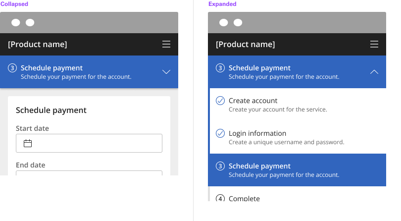

**[Back](components.md)** | **[Storybook](https://dev.dxo.ondotcloud.com/storybook-static/index.html?path=/story/pixel-components-progressindicator--progress-indicator-element)**

# Progress Indicator

A progress indicator is a visual representation of a user’s progress through a set of steps, guiding toward the completion of a specified process.

## Usage

Use progress indicators to keep the user on track when completing a specific task. By dividing the end goal into smaller, sub-tasks, it increases the percentage of completeness as each task is completed. 

### Variants

| Variant      | Purpose |
|:------------ | :------ |
| Horizontal   | This application is more suited for desktop and tablet experiences since horizontal scaling is the targeted approach. |
| Vertical     | This application is more suited for mobile since vertical scaling is the targeted approach. |

### Anatomy

1. **Badge/Icon** - Provides additional logical indicator.
2. **Label name** - Title of the current step the user is one.
3. **Optional text** - Description of the step if needed.
4. **Status Border** - Provides and additional progressive indicator.

### Logical progression

Display the steps in order from left to right. Indicate to the user that they are performing a multistep process and show the direction of movement. Allow the user to return to a previous step to review their data submission.

### Indicate the current step

Keeping the user informed of where they currently are within the process or task at hand will give them a sense of control. This helps the user to know where they are in relation to where they have been, and what sections are to follow. Clear labels should accompany the progress indicator to indicate what the user will accomplish within each step. Keep labels between one to two words.

### Validation

Use validation to confirm that a previous step has been completed. If the user cannot proceed onto another step without first completing a task, use an [Inline Notification](notifications.md) to inform them.

## Style

### Color

All steps that have been completed are indicated by an outlined circle with a checkmark. The current step the user is on is indicated by a filled circle. Steps the user has not encountered yet, or future steps, are indicated by an outlined circle.

| State                      | Element                    | Property                   | Token name                 |
| :------------------------- | :------------------------- | :------------------------- | :------------------------- |
| Enabled                    | Container                  | Background Color           | `$layer_1`                 |
|                            |                            | Border Color               | `$border_subtle_1`         | 
|                            |                            | Box Shadow                 |                            | 
|                            | Title                      | Text Color                 | `$text_primary`            |
|                            | Description                | Text Color                 | `$text_secondary`          |
|                            | Icon                       | SVG Color                  | `$icon_secondary`          |
| Hover                      | Container                  | Background Color           | `$layer_hover_1`           |
|                            |                            | Border Color               | `$border_subtle_1`         | 
|                            |                            | Box Shadow                 |                            | 
|                            | Title                      | Text Color                 | `$text_primary`            |
|                            | Description                | Text Color                 | `$text_secondary`          |
|                            | Icon                       | SVG Color                  | `$icon_secondary`          |
| Focus                      | Container                  | Background Color           | `$focus_highlight`         |
|                            |                            | Border Color               | `$focus`                   | 
|                            |                            | Box Shadow                 |                            | 
|                            | Title                      | Text Color                 | `$text_primary`            |
|                            | Description                | Text Color                 | `$text_secondary`          |
|                            | Icon                       | SVG Color                  | `$icon_secondary`          |
| Selected                   | Container                  | Background Color           | `$layer_selected_1`        |
|                            |                            | Border Color               |                            | 
|                            |                            | Box Shadow                 |                            | 
|                            | Title                      | Text Color                 | `$text_on_color`           |
|                            | Description                | Text Color                 | `$text_on_color`           |
|                            | Icon                       | SVG Color                  | `$icon_on_color`           |
| Error                      | Container                  | Background Color           | `$support_bg_error`        |
|                            |                            | Border Color               | `$border_subtle_1`         | 
|                            |                            | Box Shadow                 |                            | 
|                            | Title                      | Text Color                 | `$support_error`           |
|                            | Description                | Text Color                 | `$support_error`           |
|                            | Icon                       | SVG Color                  | `$support_error`           |
| Disabled                   | Container                  | Background Color           | `$layer_disabled_1`        |
|                            |                            | Border Color               | `$border_subtle_1`         | 
|                            |                            | Box Shadow                 |                            | 
|                            | Title                      | Text Color                 | `$text_disabled`           |
|                            | Description                | Text Color                 | `$text_disabled`           |
|                            | Icon                       | SVG Color                  | `$text_disabled`           |

### Typography

Labels should be one to two words only, with a limit of 16 characters total per label. All labels should be set in sentence case.

| Element               | Font size | Font weight             | Token name                 |
| :-------------------- | :-------- | :---------------------- | :------------------------- | 
| Title                 | 16px      | 700 bold                | `$h5_standard_bold`        |
| Description           | 14px      | 400 regular             | `$body_1_standard_regular` |

### Token architecture

| Token name                          | Description                                            |
| :---------------------------------- | :----------------------------------------------------- |
| `$progress_indicator_small`         | Defines height for the **small** variant.              |
| `$progress_indicator_medium`        | Defines height for the **medium** variant.             |
| `$progress_indicator_large`         | Defines height for the **large** variant.              |
| `$progress_indicator_padding`       | Defines **padding** for the component.                 |
| `$progress_indicator_margin`        | Defines **margin** for the component.                  |
| `$progress_indicator_border`        | Defines **border** weight for the accordion component. |
| `$progress_indicator_border_radius` | Defines **border radius** for the component.           |

**Horizontal (Desktop)**

| Element               | Property                | Size      | Token name                   |
| :-------------------- | :---------------------- | :-------- | :--------------------------- |
| Container             | Minimum Width           | 128px     |                              |
|                       | Padding Right x Left    | 16px      | `$progress_indicator_padding`|
|                       | Border Top              | 4px       |                              |
|                       | Border Right            |           |                              |
| Title                 | Margin Bottom           | 2px       | `$spacing_2`                 |
| Badge                 | Height x Width          | 28px      | `$badge_medium`              |
|                       | Margin Right            | 8px       | `$progress_indicator_margin` |
| Icon                  | Height x Width          | 20px      | `$icon_small`                |
|                       | Margin Left             | 8px       | `$progress_indicator_margin` |

**Vertical (Mobile)**

| Element               | Property                | Size      | Token name                   |
| :-------------------- | :---------------------- | :-------- | :--------------------------- |
| Container             | Minimum Width           | 100%      |                              |
|                       | Padding Right x Left    | 16px      | `$progress_indicator_padding`|
|                       | Border Left             | 4px       |                              |
|                       | Border Bottom           | 1px       | `$progress_indicator_border` |
| Title                 | Margin Bottom           | 2px       | `$spacing_2`                 |
| Badge                 | Height x Width          | 28px      | `$badge_medium`              |
|                       | Margin Right            | 8px       | `$progress_indicator_margin` |
| Icon                  | Height x Width          | 20px      | `$icon_small`                |
|                       | Margin Right            | 8px       | `$progress_indicator_margin` |

## Accessiblity

- Link text is the visible label for the native HTML link and is used to provide the purpose of the link which is clear and easy to understand for all users.
- Labels are clear, concise and include the state of each step.

### Accessibility testing

Automated, manual and screen reader accessibility verification test has been performed on the progress indicator React component. WCAG 2.1 Level A and AA success criteria issues have been identified and the list of open accessibility violations is available in the component GitHub repository.

| Environment                                 | Results (DAP) |
| :------------------------------------------ | :------------ |
| macOS Mojave version 10.14.6 with VoiceOver | No Violations |
| Chrome version 77.0.3865.90                 | No Violations | 

