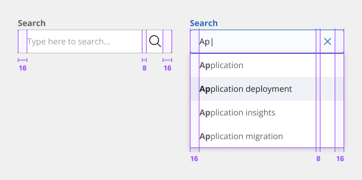

**[Back](components.md)** | **[Storybook](https://dev.dxo.ondotcloud.com/storybook-static/index.html?path=/story/pixel-components-search--search)**

# Search

Search enables users to specify a word or a phrase to find relevant content without navigation. Search offers users a way to explore a website or application using keywords. Search can be used as the primary means of discovering content or as a filter to aid the user in finding content.

## Usage

### When to use

- To help users find data more efficiently within a complex or large data set.
- Use at a global level when searching an entire site.
- Use at a page level when searching through content on one page specifically.
- Use at a component level when searching data in a component, like a data table.

### When not to use

- Do not use when there are small or limited amounts of data.
- Do not use when the information is simple and can be found easily within one view.

### Anatomy

1. **Label** - Text that informs the user about the content they need to enter in the field. It is required unless you get an approved accessibility exemption. (Optional)
2. **Field** - The place where a user enters their search query.
3. **Search icon** - Signifies a search field. The magnifying glass icon is a universal way to indicate search.
4. **Field text** - Inputted search text by the user. Placeholder text is visible before the user types into the field.
5. **Close icon** - Appears after the user has actively typed into the search field. Acts as a function to clear the search field.
6. **Result Panel** - Search result appear based on user inputs.

### Placement

Place the search component within a user interface where users expect to find it and where it is appropriate for how it is being used in context, whether at a global level, page-specific level, or within a component. The default search can be arranged on the grid to align the container with other components containers. Search can also hang to align with other hanging component containers on the same page, depending on the use case.
 
- Do align the default search container vertically with other text on the page.
- Do hang the fluid search container with other hanging components.

### Size

There are three default search height sizes: small, medium, and large. The width varies in size based on content, layout, and design. Supporting three different search sizes gives you more flexibility when structuring layouts.

| Size        | Purpose |
|:----------- | :------ |
| Small       | Use when space is constricted within a design. |
| Medium      | This is the default size and the most commonly used size. When in doubt, use the medium size. | 
| Large       | Use when there is a lot of space to work with. The large size is typically at a global level when the user is searching content within a page view. | 

### Content

#### Placeholder text

Useful and short text hinting at what the user can search for. For example, “Search for networks or devices.”

#### Field text

- Key words entered by the user to find a search result.
- Keep the field text concise and relate the field text as closely to the result you want to find.

### Universal behaviors

#### States

The search component has four states: enabled, focus, filled, and disabled.

### Mouse

Click on the search field input to start typing. Once a user starts typing, a close icon (‘x’) will appear and provides a way to clear the input field by clicking on the Close icon.

### Keyboard

Press `Enter` to submit text as a search term or press `Esc` to clear the search field. Once a user starts typing, a Close icon (‘x’) will appear and provides a way to clear the input field by pressing the `Space` or `Enter` keys.

## Style

### Color

| State                      | Element                    | Property                   | Token name                 |
| :------------------------- | :------------------------- | :------------------------- | :------------------------- |
| Enabled                    | Container                  | Background Color           |                            |
|                            |                            | Border Color               |                            |  
|                            | Label                      | Text Color                 | `$text_secondary`          |
|                            | Icon                       | SVG Color                  | `$icon_secondary`          |
| Hover                      | Container                  | Background Color           | `$layer_hover_1`           |
|                            |                            | Border Color               |                            |  
|                            | Label                      | Text Color                 | `$text_primary`            |
|                            | Icon                       | SVG Color                  | `$icon_primary`            |
| Range                      | Container                  | Background Color           | `$layer_hover_1`           |
|                            |                            | Border Color               |                            |  
|                            | Label                      | Text Color                 | `$text_primary`            |
|                            | Icon                       | SVG Color                  | `$icon_primary`            |
| Active                     | Container                  | Background Color           |                            |
|                            |                            | Border Color               | `$border_interactive`      |  
|                            | Label                      | Text Color                 | `$link_primary`            |
|                            | Icon                       | SVG Color                  | `$link_primary`            |
| Selected                   | Container                  | Background Color           | `$layer_selected_1`        |
|                            |                            | Border Color               |                            |  
|                            | Label                      | Text Color                 | `$text_on_color`           |
|                            | Icon                       | SVG Color                  | `$icon_on_color`           |
| Focus                      | Container                  | Background Color           | `$focus_highlight`         |
|                            |                            | Border Color               | `$focus`                   |  
|                            | Label                      | Text Color                 | `$text_primary`            |
|                            | Icon                       | SVG Color                  | `$icon_primary`            |
| Disabled                   | Container                  | Background Color           |                            |
|                            |                            | Border Color               |                            |  
|                            | Label                      | Text Color                 | `$text_disabled`           |
|                            | Icon                       | SVG Color                  | `$icon_disabled`           |

### Typography

Search text should be set in sentence case, with only the first letter of the first word capitalized.

| State      | Element         | Font size | Font weight | Token name                |
| :--------- | :-------------- | :-------- | :---------- | :------------------------ | 
| Small      | Label           | 14px      | 700 bold    | `$label_1_bold`           |
|            | Helper Text     | 12px      | 400 regular | `$helper_text_1_regular`  |
|            | Value           | 14px      | 400 regular | `$body_1_compact_regular` |
|            | Placeholder     | 14px      | 400 regular | `$body_1_compact_regular` |
|            | Contextual Menu | 14px      | 400 regular | `$body_1_compact_regular` |
| Medium     | Label           | 14px      | 700 bold    | `$label_1_bold`           |
|            | Helper Text     | 12px      | 400 regular | `$helper_text_1_regular`  |
|            | Value           | 14px      | 400 regular | `$body_1_compact_regular` |
|            | Placeholder     | 14px      | 400 regular | `$body_1_compact_regular` |
|            | Contextual Menu | 14px      | 400 regular | `$body_1_compact_regular` |
| Large      | Label           | 14px      | 700 bold    | `$label_1_bold`           |
|            | Helper Text     | 12px      | 400 regular | `$helper_text_1_regular`  |
|            | Value           | 16px      | 400 regular | `$body_2_compact_regular` |
|            | Placeholder     | 16px      | 400 regular | `$body_2_compact_regular` |
|            | Contextual Menu | 16px      | 400 regular | `$body_2_compact_regular` |

### Token Architecture

| Token name                  | Description                                            |
| :-------------------------- | :----------------------------------------------------- |
| `$search_small`             | Defines height for the **small** variant.              |
| `$search_medium`            | Defines height for the **medium** variant.             |
| `$search_large`             | Defines height for the **large** variant.              |
| `$search_padding`           | Defines **padding** for the component.                 |
| `$search_margin`            | Defines **margin** for the component.                  |
| `$search_border`            | Defines **border** weight for the accordion component. |
| `$search_border_radius`     | Defines **border radius** for the component.           |

### Structure

The width of the search field should appropriately fit the design and layout of content. The width may vary based on the grid and layout.

| Element               | Property                | Size      | Token name                  |
| :-------------------- | :---------------------- | :-------- | :-------------------------- |
| Input                 | Padding Right x Left    | 16px      | `$text_input_padding`       |
|                       | Border                  | 1px       | `$text_input_border`        |
|                       | Border Radius           | 4px       | `$text_input_border_radius` |
| Icon (Left)           | Margin Right            | 8px       | `$text_input_margin`        |
| Icon (Right)          | Margin Left             | 8px       | `$text_input_margin`        |
| Label                 | Margin Bottom           | 2px       | `$spacing_2`                |
| Helper Text           | Margin Top              | 2px       | `$spacing_2`                |

### Size

| Size    | Element               | Property       | Size      | Token name                |
| :------ | :-------------------- | :------------- | :-------- | :------------------------ |
| Small   | Input                 | Height         | 32px      | `$text_input_small`       |
|         | Icon                  | Height x Width | 20px      | `$icon_small`             |
| Medium  | Input                 | Height         | 40px      | `$text_input_medium`      |
|         | Icon                  | Height x Width | 24px      | `$icon_medium`            |
| Large   | Input                 | Height         | 48px      | `$text_input_large`       |
|         | Icon                  | Height x Width | 28px      | `$icon_large`             |

## Accessibility

The search component provides the basic input mechanism for conducting a search. No accessibility annotations are needed for the input, but design annotations are needed to make the search messaging and results accessible.

The component bakes keyboard operation into its components, improving the experience of blind users and others who operate via the keyboard. The component incorporates many other accessibility considerations, some of which are described below.

### Keyboard

The search component is in the tab order, and users can type directly into the search input on focus. Users press `Enter` to submit their text as a search term, or they can press `Esc` to clear it. Once users start typing, a Cancel icon (‘x’) will appear, which becomes the next tab stop and provides another way to clear the input field via click, `Space` or `Enter` keys.

- The search input is in the tab order just like any other input.
- The user can clear the input by pressing Esc or activating the X button that appears inside the input.

Variations of the search component use a non-persistent text input that is hidden behind a magnifying glass icon. In one variation, the user activates the icon-only button to reveal and put focus into the search input. In another variation, as the icon receives focus it exposes the input and the focus is immediately placed into the search input. Once in the input, the interaction, described above, is the same for all variations.
 
- A variation where the search input is revealed by activating the magnifying glass icon.
- A variation where the search input is revealed when the magnifying glass receives focus.

### Role and label

The components assigns the entire search interaction a role of “search”. It also provides non-visible labels for the search input and icon (“search”), and for the cancel icon (“clear search input”). The search region, input name, and clear button are all incorporated.

### Design recommendations

The component provides a search pattern that outlines three search types: basic, active, and focused. Each of these types starts with the basic search input mechanism provided by the search component. However, each search type displays suggestions or results in different ways, which all have accessibility considerations. There are three broad areas that designers need to consider and annotate for accessibility:
 
- Search suggestions and typeaheads
- Search outcomes and status (e.g., “25 results found”, “no results found”)
- Results navigation
- Future updates to this guidance will offer specific documentation on these accessibility needs.

### Development considerations

Keep these considerations in mind if you are modifying the component or creating a custom component.
 
- The div containing the search function is given a `role="button"`.
- The hidden label for the input has a default value of “search”.
- The input is `type="text"` with a `role="searchbox"`; using `type="search"` is equivalent and also valid.
- See the [Mozilla search input documentation](https://developer.mozilla.org/en-US/docs/Web/HTML/Element/input/search) for more considerations.

