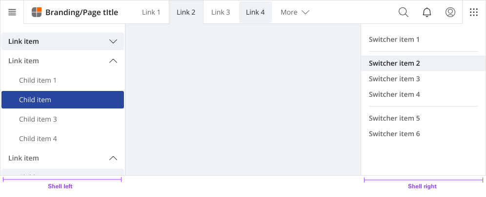
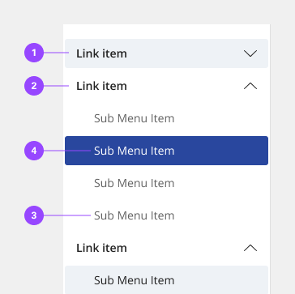
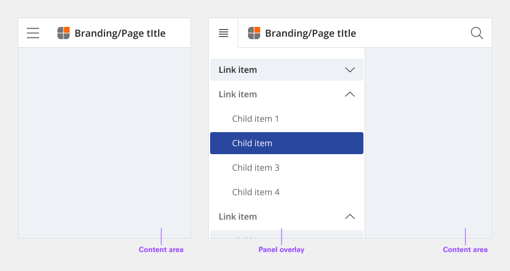
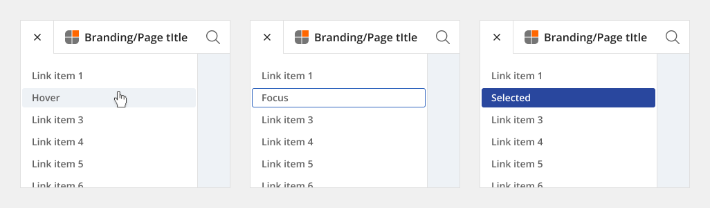
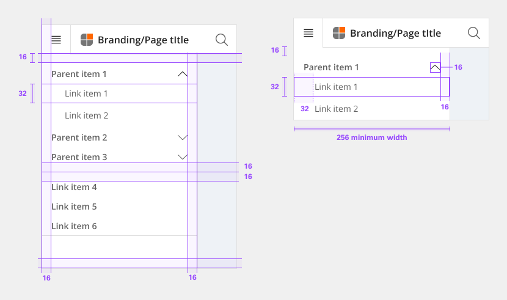
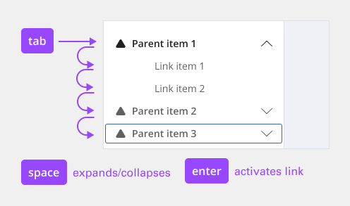

**[Back](components.md)** | **[Storybook](https://dev.dxo.ondotcloud.com/storybook-static/index.html?path=/story/pixel-components-panel--left-panel)**

# Left shell

The left shell is part of the shell components. A shell is a collection of components shared by all products within a platform. It provides a common set of interaction patterns that persist between and across products.

## Usage

The UI shell is made up of three components—the header, the left shell, and the right shell. All three can be used independently, but the components were designed to work together.

| Shell       | Purpose |
|:----------- | :------ |
| Header      | The highest level of navigation. The header can be used on its own for simple products or be used to trigger the left and right shells. |
| Left        | An optional shell that is used for a product’s navigation. 
| Right       | An optional shell that shows additional system level actions or content associated with a system icon in the header. 
| Footer      | An optional shell that shows copyright information or mirrored site navigation.

### Anatomy

The left shell contains secondary navigation and is positioned below the header and fixed to the left. Both links and sub-menus can be used in the side-nav and may be mixed together.

1. Link item
2. Link item expanded
3. Sub item
4. Sub item selected

### Universal Behavior

Use the left shell if there are more than five secondary navigation items, or if you expect a user to switch between secondary items frequently. Sub-menus are denoted with a chevron and expand when clicked, pushing the other items down in the shell. To collapse the sub-menu, the user must again click the menu header in the left shell.

The left shell does not support three tiers of navigation. If you have additional content to display beneath a sub-menu, use tabs within the page.

## Style

### Color

**shell**

| State                      | Element                    | Property                   | Token name                 |
| :------------------------- | :------------------------- | :------------------------- | :------------------------- |
| Enabled                    | Container                  | Background Color           | `$layer_01`                | 
|                            |                            | Border Color               | `$border_subtle_1`         |

**Link**

The contextual menu sub component uses the same color and specifications as contained lists.

| State                      | Element                    | Property                   | Token name                 |
| :------------------------- | :------------------------- | :------------------------- | :------------------------- |
| Enabled                    | Container                  | Background Color           | `$layer_01`                | 
|                            |                            | Border Color               | `$border_subtle_1`         |
|                            | Label                      | Text Color                 | `$text_secondary`          |
|                            | Icon (Chevron)             | SVG Color                  | `$icon_secondary`          |
|                            | Icon                       | SVG Color                  | `$icon_secondary`          |
| Hover                      | Container                  | Background Color           | `$layer_hover_01`          | 
|                            |                            | Border Color               | `$border_subtle_1`         |
|                            | Label                      | Text Color                 | `$text_primary`            |
|                            | Icon (Chevron)             | SVG Color                  | `$icon_primary`            |
|                            | Icon                       | SVG Color                  | `$icon_primary`            |
| Selected                   | Container                  | Background Color           | `$layer_selected_01`       | 
|                            |                            | Border Color               |                            |
|                            | Label                      | Text Color                 | `$text_on_color`           |
|                            | Icon (Chevron)             | SVG Color                  | `$icon_on_color`           |
|                            | Icon                       | SVG Color                  | `$icon_on_color`           |
| Focus                      | Container                  | Background Color           | `$focus_highlight`         | 
|                            |                            | Border Color               | `$focus`                   |
|                            | Label                      | Text Color                 | `$text_primary`            |
|                            | Icon (Chevron)             | SVG Color                  | `$icon_primary`            |
|                            | Icon                       | SVG Color                  | `$icon_primary`            |
| Disabled                   | Container                  | Background Color           | `$layer_disabled_1`        | 
|                            |                            | Border Color               | `$border_subtle_1`         |
|                            | Label                      | Text Color                 | `$text_disabled`           |
|                            | Icon (Chevron)             | SVG Color                  | `$icon_disabled`           |
|                            | Icon                       | SVG Color                  | `$icon_disabled`           |

### Typography

Menu labels and text should be set in sentence case.

| Element               | Font size | Font weight             | Token name                 |
| :-------------------- | :-------- | :---------------------- | :------------------------- | 
| Sub menu link         | 14px      | 700 bold                | `$body_1_compact_regular`  |
| Link                  | 14px      | 700 bold                | `$body_1_compact_bold`     |

### Token Architecture

| Token name                  | Description                                            |
| :-------------------------- | :----------------------------------------------------- |
| `$shell_small`              | Defines height for the **small** variant.              |
| `$shell_medium`             | Defines height for the **medium** variant.             |
| `$shell_large`              | Defines height for the **large** variant.              |
| `$shell_padding`            | Defines **padding** for the component.                 |
| `$shell_margin`             | Defines **margin** for the component.                  |
| `$shell_border`             | Defines **border** weight for the accordion component. |
| `$shell_border_radius`      | Defines **border radius** for the component.           |

### Structure

| Element               | Property                | Size      | Token name                  |
| :-------------------- | :---------------------- | :-------- | :-------------------------- |
| Shell                 | Minimum                 | 256px     |                             |
|                       | Padding Top x Bottom    | 16px      | `$shell_padding`            |
| Link item             | Width                   | 100%      |                             |
|                       | Padding Right x Left    | 16px      | `$shell_padding`            |
|                       | Border Bottom           | 1px       | `$shell_border`             |
| Link item (2nd tier)  | Margin Left             | 32px      |                             |
| Link item (3rd tier)  | Margin Left             | 72px      |                             |
| Icon (Decorative)     | Height x Width          | 20px      | `$icon_small`               |
|                       | Margin Right            | 8px       | `$shell_margin`             |
| Icon (Chevron)        | Height x Width          | 20px      | `$icon_small`               |
|                       | Margin Left             | 8px       | `$shell_margin`             |

### Size

| Size    | Element               | Property       | Size      | Token name                |
| :------ | :-------------------- | :------------- | :-------- | :------------------------ |
| Small   | Link item             | Height         | 32px      | `$contain_list_small`     |
|         | Icon (Decorative)     | Height x Width | 20px      | `$icon_small`             |
|         | Icon (Chevron)        | Height x Width | 20px      | `$icon_small`             |
| Medium  | Link item             | Height         | 40px      | `$contain_list_medium`    |
|         | Icon (Decorative)     | Height x Width | 20px      | `$icon_small`             |
|         | Icon (Chevron)        | Height x Width | 20px      | `$icon_small`             |
| Large   | Link item             | Height         | 48px      | `$contain_list_large`     |
|         | Icon (Decorative)     | Height x Width | 20px      | `$icon_medium`            |
|         | Icon (Chevron)        | Height x Width | 20px      | `$icon_medium`            |

## Accessibility

The component bakes keyboard operation into its components, improving the experience of blind users and others who operate via the keyboard. The component incorporates many other accessibility considerations, some of which are described below.

### Keyboard

The left shell is comprised of both expandable sections (often called “sub-menus”) and links to content. All items can be reached by `Tab`. Toggling a collapsed section with `Space` or `Enter` expands it, which reveals additional links. Activating any of the links (with `Enter`) updates the main content area and puts focus back at the top of the page. The link becomes bold to show it is the current page. (It remains in the tab order, but can no longer be activated.)

Sub-menus and links are reached by `Tab`. `Space` and `Enter` keys expand/collapse sub-menus, and the `Enter` key is used to activate links.

### Non-persistent left shell

On smaller screens, or if content is zoomed up to approximately 175% magnification, The component responsively hides the left shell behind a ‘hamburger’ button, which appears at the start of the UI shell header. Activating the button (with `Space` or `Enter`) causes the left shell to appear. It overlays the main content area, which often becomes dimmed. The hamburger button’s icon becomes an X, and must be activated to close the left shell.

The left shell can also be implemented as a “Side rail” variant, which slides into view from the left side when reached by keyboard or hovered by mouse. Keyboard interaction within the revealed left shell does not change. When users tab out of the left shell, the side rail slides out of view.

### Development considerations

Keep these considerations in mind if you are modifying the component or creating a custom component.

- The left shell is in a `<nav>` section with aria-label="Side navigation".
- All items in the left shell are in a nested `<ul>` structure, which provides additional information to assistive technologies.
- Each ‘sub-menu’ is implemented as a `<button> `with aria-expanded.
- Activated links receive an `aria-current="page"` attribute.

