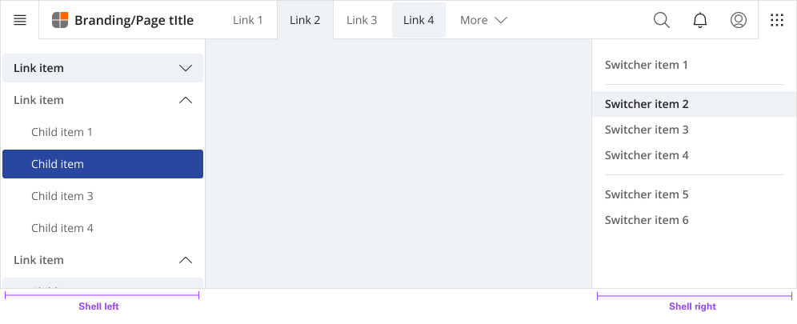
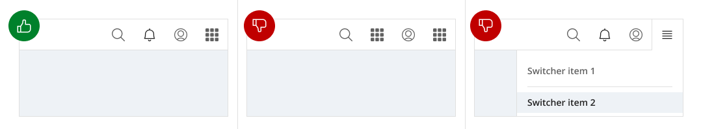

**[Back](components.md)** | **[Storybook](https://dev.dxo.ondotcloud.com/storybook-static/index.html?path=/story/pixel-components-panel--left-panel)**

# Right shell

The right shell is part of the shell components. A shell is a collection of components shared by all products within a platform. It provides a common set of interaction patterns that persist between and across products.

## Usage

The UI shell is made up of three components—the header, the left shell, and the right shell. All three can be used independently, but the components were designed to work together.

| Shell       | Purpose |
|:----------- | :------ |
| Header      | The highest level of navigation. The header can be used on its own for simple products or be used to trigger the left and right shells. |
| Left        | An optional shell that is used for a product’s navigation. 
| Right       | An optional shell that shows additional system level actions or content associated with a system icon in the header. 
| Footer      | An optional shell that shows copyright information or mirrored site navigation.

### Anatomy

The right shell is invoked by icons on the right side of the header, and remains anchored to that icon. Right shells have a consistent width, span the full height of the viewport, and are flush to the right edge of the viewport.

#### Switcher item
A switcher item is anything that changes what product, offering, or property occupies the UI shell. Consider moments in a product when you switch from a calendar to a mailbox, from Kubernetes to Catalog. These items belong in the switcher.

#### Switcher divider
A switcher divider groups similar switcher items. You can use a divider to set apart a parent domain, group child domains similar in hierarchy to the parent, and set apart additional resources. The divider should not be used to separate every switcher item.

### Switcher

The far right header icon is reserved for the switcher icon. The switcher icon and the switcher shell should only be used together.

- Positioned the switcher to the far right.
- Do not position other icons to the right of the switcher.
- Do not use another icon for the switcher.

### Universal behavior

#### Expansion

Right shells always float over page content, and always remain anchored to their associated icon. You can have multiple right shells, but only one can be expanded at any time.

#### Dismissal

Once expanded, the shell’s associated icon is outlined, with its bottom border flowing into the shell. To dismiss the shell, a user must select an item, or click or tap the header icon.

#### Selected state

There is no selected state for right shell items. Even if a user is currently within one of the shell items, the item remains unselected.

## Style

### Color

**shell**

| State                      | Element                    | Property                   | Token name                 |
| :------------------------- | :------------------------- | :------------------------- | :------------------------- |
| Enabled                    | Container                  | Background Color           | `$layer_01`                | 
|                            |                            | Border Color               | `$border_subtle_1`         |

**Link**

The contextual menu sub component uses the same color and specifications as contained lists.

| State                      | Element                    | Property                   | Token name                 |
| :------------------------- | :------------------------- | :------------------------- | :------------------------- |
| Enabled                    | Container                  | Background Color           | `$layer_01`                | 
|                            |                            | Border Color               | `$border_subtle_1`         |
|                            | Label                      | Text Color                 | `$text_secondary`          |
|                            | Icon (Chevron)             | SVG Color                  | `$icon_secondary`          |
|                            | Icon                       | SVG Color                  | `$icon_secondary`          |
| Hover                      | Container                  | Background Color           | `$layer_hover_01`          | 
|                            |                            | Border Color               | `$border_subtle_1`         |
|                            | Label                      | Text Color                 | `$text_primary`            |
|                            | Icon (Chevron)             | SVG Color                  | `$icon_primary`            |
|                            | Icon                       | SVG Color                  | `$icon_primary`            |
| Selected                   | Container                  | Background Color           | `$layer_selected_01`       | 
|                            |                            | Border Color               |                            |
|                            | Label                      | Text Color                 | `$text_on_color`           |
|                            | Icon (Chevron)             | SVG Color                  | `$icon_on_color`           |
|                            | Icon                       | SVG Color                  | `$icon_on_color`           |
| Focus                      | Container                  | Background Color           | `$focus_highlight`         | 
|                            |                            | Border Color               | `$focus`                   |
|                            | Label                      | Text Color                 | `$text_primary`            |
|                            | Icon (Chevron)             | SVG Color                  | `$icon_primary`            |
|                            | Icon                       | SVG Color                  | `$icon_primary`            |
| Disabled                   | Container                  | Background Color           | `$layer_disabled_1`        | 
|                            |                            | Border Color               | `$border_subtle_1`         |
|                            | Label                      | Text Color                 | `$text_disabled`           |
|                            | Icon (Chevron)             | SVG Color                  | `$icon_disabled`           |
|                            | Icon                       | SVG Color                  | `$icon_disabled`           |

### Typography

Menu labels and text should be set in sentence case.

| Element               | Font size | Font weight             | Token name                 |
| :-------------------- | :-------- | :---------------------- | :------------------------- | 
| Sub menu link         | 14px      | 700 bold                | `$body_1_compact_regular`  |
| Link                  | 14px      | 700 bold                | `$body_1_compact_bold`     |

### Token Architecture

| Token name                  | Description                                            |
| :-------------------------- | :----------------------------------------------------- |
| `$shell_small`              | Defines height for the **small** variant.              |
| `$shell_medium`             | Defines height for the **medium** variant.             |
| `$shell_large`              | Defines height for the **large** variant.              |
| `$shell_padding`            | Defines **padding** for the component.                 |
| `$shell_margin`             | Defines **margin** for the component.                  |
| `$shell_border`             | Defines **border** weight for the accordion component. |
| `$shell_border_radius`      | Defines **border radius** for the component.           |

### Structure

| Element               | Property                | Size      | Token name                  |
| :-------------------- | :---------------------- | :-------- | :-------------------------- |
| Shell                 | Minimum                 | 256px     |                             |
|                       | Padding Top x Bottom    | 16px      | `$shell_padding`            |
| Link item             | Width                   | 100%      |                             |
|                       | Padding Right x Left    | 16px      | `$shell_padding`            |
|                       | Border Bottom           | 1px       | `$shell_border`             |
| Link item (2nd tier)  | Margin Left             | 32px      |                             |
| Link item (3rd tier)  | Margin Left             | 72px      |                             |
| Icon (Decorative)     | Height x Width          | 20px      | `$icon_small`               |
|                       | Margin Right            | 8px       | `$shell_margin`             |
| Icon (Chevron)        | Height x Width          | 20px      | `$icon_small`               |
|                       | Margin Left             | 8px       | `$shell_margin`             |

### Size

| Size    | Element               | Property       | Size      | Token name                |
| :------ | :-------------------- | :------------- | :-------- | :------------------------ |
| Small   | Link item             | Height         | 32px      | `$contain_list_small`     |
|         | Icon (Decorative)     | Height x Width | 20px      | `$icon_small`             |
|         | Icon (Chevron)        | Height x Width | 20px      | `$icon_small`             |
| Medium  | Link item             | Height         | 40px      | `$contain_list_medium`    |
|         | Icon (Decorative)     | Height x Width | 20px      | `$icon_small`             |
|         | Icon (Chevron)        | Height x Width | 20px      | `$icon_small`             |
| Large   | Link item             | Height         | 48px      | `$contain_list_large`     |
|         | Icon (Decorative)     | Height x Width | 20px      | `$icon_medium`            |
|         | Icon (Chevron)        | Height x Width | 20px      | `$icon_medium`            |

## Accessibility

The component bakes keyboard operation into its components, improving the experience of blind users and others who operate via the keyboard. The component incorporates many other accessibility considerations, some of which are described below.

### Keyboard

The left shell is comprised of both expandable sections (often called “sub-menus”) and links to content. All items can be reached by `Tab`. Toggling a collapsed section with `Space` or `Enter` expands it, which reveals additional links. Activating any of the links (with `Enter`) updates the main content area and puts focus back at the top of the page. The link becomes bold to show it is the current page. (It remains in the tab order, but can no longer be activated.)

- Activating the switch button with `Enter` or `Space` toggles the display of the right shell.
- Links are reached by `Tab` and activated by `Enter` key. Activating links or pressing `Esc` key closes shell.

### Design recommendations

#### Annotating the switcher button name

When necessary, designers may need to change the icon-only switcher button’s name to match the right shell’s scope. Depending on the context of the design, common button names include “Switch site” or “App switcher”.

### Development considerations

Keep these considerations in mind if you are modifying the component or creating a custom component.

- The right shell is in a `<nav>` section.
- All links in the right shell are in a `<ul>` structure, which provides additional information to assistive technologies.

