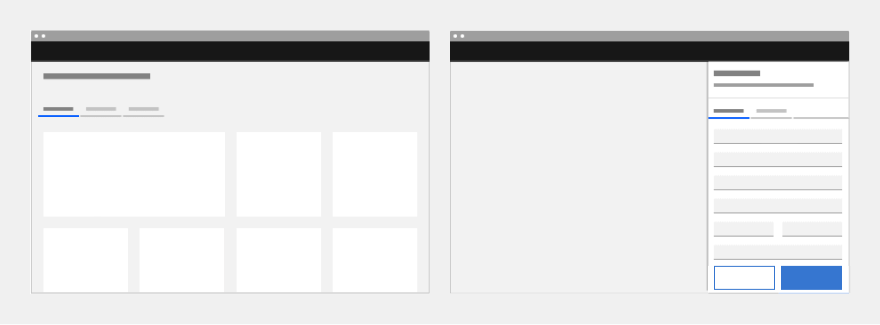
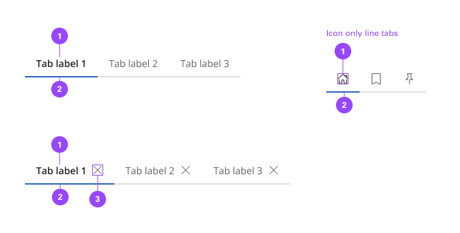
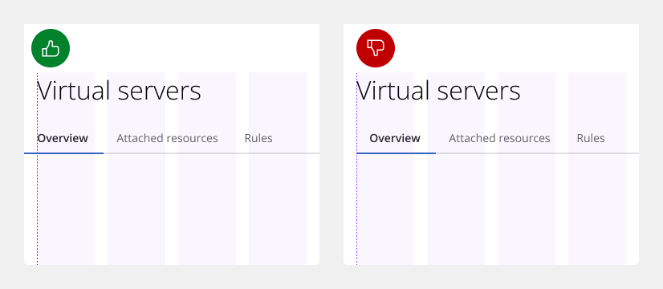
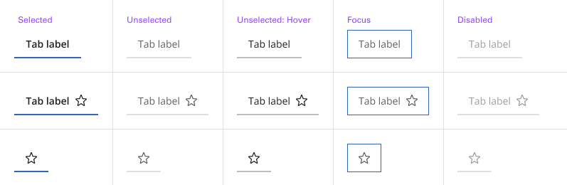
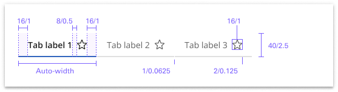
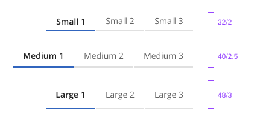
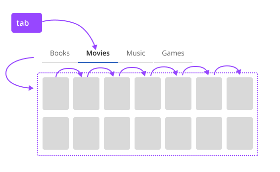

# Tab Navigation

Tabs are used to group different but related content, allowing users to navigate views without leaving the page. They always contain at least two items and one tab is active at a time. Tabs can be used on full page layouts or in components such as modals, cards, or side panels.

## Usage

### When to use

Use tabs to group related information into different categories, helping to reduce cognitive load.

### When not to use

- Tabs should never be used for primary navigation. If tabs become too complex, consider using a standard navigation pattern.
- Tabs should not be used to indicate progress. Use the progress indicator instead.
- Tabs should not be used if the user is comparing information in two groups, as this would result in the user having to click back and forth to complete a task.

### Anatomy

The tab component consists of two distinct zones: selected and unselected. There are always at least two tabs, and one is selected by default. Icons are optional.

1. Label
2. Indicator
3. Icon (Optional)

### Alignment

Much like buttons, alignment of tabs depends on where they appear and whether they are contained within another component. As a rule, the first label for both line tabs and contained tabs align with the grid and the text below. If tabs are within another component, such as a card, follow the grid that you are using inside the component and align the label with text in the component. Do align tab labels with the grid.

- Do vertically align tab labels with the grid.
- Do not vertically align tab containers with the grid.

### Auto width

Line tabs, auto-width is the default behavior. Each tab will be a different size depending on the label’s character count but will have consistent padding on each side of the label. The first label, selected by default, should align to the grid. Where the tabs end will vary and may not end on the grid. If needed, you may also use a line to help balance tabs with other components on the page.

### Aligning to grid columns

Instead of using the default auto-width behavior, contained tabs also have the option to align to the grid. As a group, the tabs span a set of columns with each tab being equal in size. The first tab’s label should align to the first column you are using with the last tab in the group always ending at a column’s edge. The tabs in between will flow accordingly and may or may not align to the grid but will always be the same size. Use the 2x grid to drive visual rhythm by spacing content in multiples of two columns and aligning the beginning and ending of the tab elements with content below the tabs when possible.

### Alignment within a component

When using line tabs within a component (like a modal) the first label should always align to the other content in the space. The edges of the line tab may also bleed to the edges of the space if needed depending on the container’s margins. To add hierarchical clarity and balance the tabs with the other content, a line may be added from the end of the last tab to the edge of the content area.

### Content

- Use short tab labels that are clear and specific. Labels should be one to two words, as these are easier to scan.
- Text labels should clearly communicate the view users will see and the content contained in the view.

### Universal behaviors

The data table’s toolbar and rows follow interaction conventions found in other components. Buttons, checkboxes, radio buttons, overflow menus, search, and expanding elements are used in the data table, and all behave accordingly to their guidelines.

#### Mouse

Users can trigger an action or function in the table by clicking the associated button or component. Each action or function has its own distinct click target. Users can trigger a state change by clicking anywhere in the container area.

#### Keyboard

One tab should be selected by default. Users can navigate between tabs by pressing right or left arrow keys.

#### Screen readers

Users can navigate between tabs by pressing flick-right or flick-left arrow keys.

### States

Tabs allow for three states: selected, unselected, and disabled. The default view is that one tab is preselected and is usually the first tab. Only one tab can be selected at a time. When a user chooses a new item, the previous tab is automatically deselected. If a user navigates away from a tab, a user should return to the last tab selected.

### Related

#### Content switcher versus tabs

Content switchers allow users to compare and toggle between alternate views of similar or related content. Content that is grouped into tabs is part of the same bigger context but the content does not overlap.

#### Navigation versus

Tabs should not be used for common navigation patterns. If your tab arrangements are becoming too complex with different levels of content, consider using left or right UI panels, possibly in conjunction with breadcrumbs, to help the user through the content.

#### Progress indicator versus tabs

Progress indicator content moves in a logical progression, showing next steps to guide the user through the completion of a task. Tabs organize content into groups that the user can navigate through; they do not support progressive tasks.

## Style

Below is the token architecture color build of the components. The token can be changed or defined through the token mapping script that has been placed in the application repository.

### Color

| State                      | Element                    | Property                   | Token name                 |
| :------------------------- | :------------------------- | :------------------------- | :------------------------- |
| Enabled                    | Container                  | Background Color           |                            |
|                            |                            | Border Color               | `$border_strong_1`         | 
|                            | Label                      | Text Color                 | `$text_secondary`          |
|                            | Icon                       | SVG Color                  | `$icon_secondary`          |
| Hover                      | Container                  | Background Color           | `$layer_hover_1`           |
|                            |                            | Border Color               | `$border_strong_1`         | 
|                            | Label                      | Text Color                 | `$text_primary`            |
|                            | Icon                       | SVG Color                  | `$icon_primary`            |
| Selected                   | Container                  | Background Color           |                            |
|                            |                            | Border Color               | `$border_interactive`      | 
|                            | Label                      | Text Color                 | `$text_primary`            |
|                            | Icon                       | SVG Color                  | `$icon_primary`            |
| Focus                      | Container                  | Background Color           | `$focus_highlight`         |
|                            |                            | Border Color               | `$focus`                   | 
|                            | Label                      | Text Color                 | `$text_primary`            |
|                            | Icon                       | SVG Color                  | `$icon_primary`            |
| Disabled                   | Container                  | Background Color           |                            |
|                            |                            | Border Color               | `$border_strong_1`         | 
|                            | Label                      | Text Color                 | `$text_disabled`           |
|                            | Icon                       | SVG Color                  | `$icon_disabled`           |

### Typography

Tab labels should be set in sentence case and should not exceed three words.

| State      | Element         | Font size | Font weight | Token name                |
| ---------- | --------------- | --------- | ----------- | ------------------------- | 
| Small      | Label           | 12px      | 400 regular | `$h7_compact_regular`     |
| Medium     | Label           | 14px      | 400 regular | `$h6_compact_regular`     |
| Large      | Label           | 16px      | 400 regular | `$h5_compact_regular`     |

### Token Architecture

| Token name                  | Description                                            |
| :-------------------------- | :----------------------------------------------------- |
| `$tab_small`                | Defines height for the **small** variant.              |
| `$tab_medium`               | Defines height for the **medium** variant.             |
| `$tab_large`                | Defines height for the **large** variant.              |
| `$tab_padding`              | Defines **padding** for the component.                 |
| `$tab_margin`               | Defines **margin** for the component.                  |
| `$tab_border`               | Defines **border** weight for the accordion component. |
| `$tab_border_radius`        | Defines **border radius** for the component.           |

### Structure

**Tab Bar**

| Element               | Property                | Size      | Token name                  |
| :-------------------- | :---------------------- | :-------- | :-------------------------- |
| Tab Navigation        | Width                   | 100%      |                             |
|                       | Border Bottom           | 1px       | `$tab_border`               |

**Tab**

| State            | Element               | Property                | Size      | Token name                  |
| :--------------- | :-------------------- | :---------------------- | :-------- | :-------------------------- |
| Enabled          | Tab                   | Padding Right x Left    | 16px      | `$tab_padding`              |
|                  |                       | Border Bottom           | 1px       | `$tab_border`               |
|                  | Icon (Right)          | Margin Left             | 8px       | `$tab_margin`               |
|                  | Icon (Left)           | Margin Right            | 8px       | `$tab_margin`               |
| Selected         | Tab                   | Padding Right x Left    | 16px      | `$tab_padding`              |
|                  |                       | Border Bottom           | 2px       | `$border_2`                 |
|                  | Icon (Right)          | Margin Left             | 8px       | `$tab_margin`               |
|                  | Icon (Left)           | Margin Right            | 8px       | `$tab_margin`               |

### Size

| Size    | Element               |  Size     | Token name                 |
| :------ | :-------------------- | :-------- | :------------------------- |
| Small   | Container             | 32px      | `$tab_small`               |
|         | Icon                  | 20px      | `$icon_small`              |
| Medium  | Container             | 40px      | `$tab_medium`              |
|         | Icon                  | 24px      | `$icon_medium`             |
| Large   | Container             | 48px      | `$tab_large`               |
|         | Content Switcher      | 28px      | `$icon_large`              |

## Accessibility

The component bakes keyboard operation into its components, improving the experience of blind users and others who operate via the keyboard. The component incorporates many other accessibility considerations, some of which are described below.

- Each tab must have a unique title that clearly describes tab panel content. This is particularly helpful for users of assistive technologies, so they have the necessary information to efficiently navigate the content.
- The components should be used to create the content that displays within each tab panel.
- Make sure users can move between tabs, get in and get out of the tab panel.

### Keyboard interaction

Tabs take at least two tabstops, one for the tablist and one for the tabpanel. When tabbing away from the tablist, focus will either go to the first operable element in the tabpanel or, where there are no operable elements, the entire tabpanel will take focus to support scrolling of its content.
 
- The tablist takes a single tabstop then focus moves to the first item in the tabpanel.
- Where a tabpanel has no interactive items, the focus moves from the tablist to the entire tabpanel.

Arrow keys are used to navigate between individual tab items in the tablist. When the end of the tablist is reached, the focus wraps to the opposite end of the list. For scrollable tablists, where the number of tabs exceeds the horizontal space, the keyboard navigation does not change. The user presses the Left or Right arrow key, which moves the focus to the next tab item and, where necessary, scrolls the tablist to keep the selected item visible. For mouse users, clickable arrows appear at the end of the tablist to provide the same scrolling, but these are not needed for keyboard users, and they are not in the focus order.

Arrow keys move between tabs in the tablist (wrapping from last back to first) and scroll automatically to keep the focused tab visible.

Automatic and manual tablists differ in how the tab items are activated. The following illustration shows what will happen for each variant when a right arrow key is pressed with the Overview tab selected and focused.

For automatic tablists, focus and selection are synchronized. When the user arrows to a tab, it is selected, and the tabpanel under the tab is updated in real time.

Manual tablists allow the user to arrow between the tab items without updating the tabpanel underneath. When the user right arrows, the Overview tab remains selected while focus moves to the Details tab. To select the Details tab (and update the tabpanel under the tab), the user would press `Enter` or `Space`.

### Indicate which variant to implement

The automatic and manual tablists are visually indistinguishable in a wireframe, so designers should annotate which variant the team has decided to implement. Since the choice primarily concerns technical considerations about potential latency when updating the tabpanel’s information, architects or developers should be involved in the discussion.

### Development considerations

Keep these considerations in mind if you are modifying the component or creating a custom component.
 
-	Tabs are implemented as a tablist, with each tab item implemented as a `<button>` with a role of tab.
-	The selected tab has attributes `aria-selected="true"` and `tabindex="0"`. All other tabs have these attribute values set to `false` and `-1`.
-	Each tab is associated with its tabpanel through aria-controls.
-	See the [ARIA authoring practices guidance for tabs](https://w3c.github.io/aria-practices/#tabpanel) for more considerations.
-	For accessibility considerations for manual tabs, see [Deciding when to make selection automatically follow focus](https://www.w3.org/WAI/ARIA/apg/practices/keyboard-interface/#kbd_selection_follows_focus).

