# Table

Tables are used to organize and display data efficiently. The data table component allows for customization with additional functionality, as needed by your product’s users.

## Usage

The data table’s features are ideal for organizing and displaying data in a UI. The column headers can sort data in ascending or descending order, rows can be expanded to progressively disclose information, and single or batch actions can be taken on rows.

The data table toolbar gives a location for primary buttons, search, filtering, table display settings, and other utilities.

### When to use

- To organize and display data.
- If your user must navigate to a specific piece of data to complete a task.
- Displaying all a user's resources.

### When not to use

- When a more complex display of the data or interactions are required.
- As a replacement for a spreadsheet application.

### Variants

| Variant        | Purpose |
|:-------------- | :------ |
| Default        | The basic data table has only the header and table element rows. It is available in five row sizes. |
| With selection | The selection variant enables users to select individual rows in a data table. Selection options include a single-select radio button option and a multi-select checkbox option. Users can perform a single action or batch actions against selected items.ge from one setting to another in a menu, page, or component. It can often act as a filtering mechanism. |
| With expansion | The expandable variant helps present large amounts of data in a small space. Users can expand and collapse row panels to reveal and hide additional information. |

### Anatomy

1. **Title and description** - contain the data table title and an optional description.
2. **Column header** - title for the row header with the optional sorting behavior.
3. **Table row** - can be configured to show different types of data. Rows can be selectable, expandable, and modified to show alternating zebra stripe background colors.
4. **Pagination** table bar - an optional component that lets a user navigate data as pages when the amount of data it too large to be shown at once.

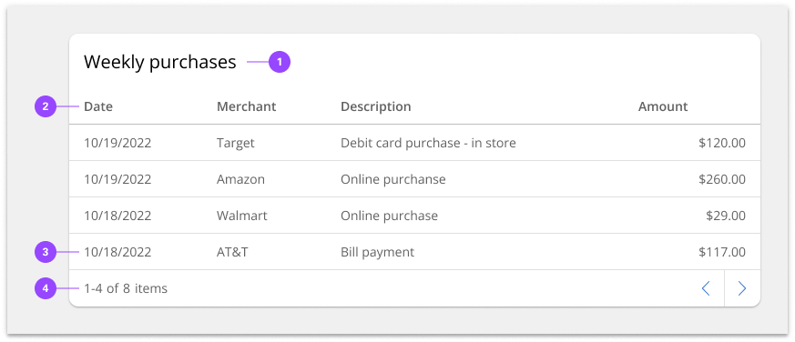

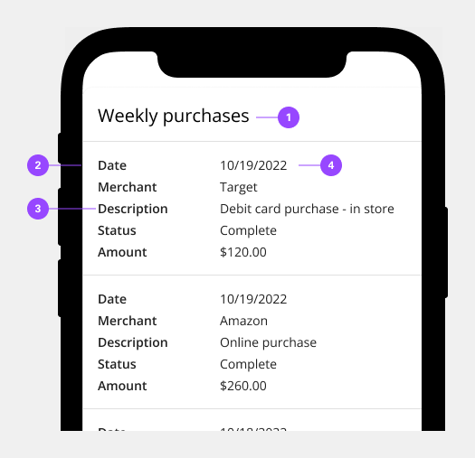

### Size

The data table is available in five different row sizes: extra-large, large, medium, small, extra small. The column header row thead should always match the row size of the table. Extra-large row heights are only recommended if your data is expected to have 2 lines of content in a single row.

- Do use the same row height for the table and header rows.
- Don’t mix row heights for the table and header rows.

Two heights are available to be paired with the row heights of the data table. The tall toolbar should only be paired with the large and extra-large row heights and the small toolbar should only be used with the small and extra small row heights. A small toolbar on a short data table and a tall toolbar on a normal data table.

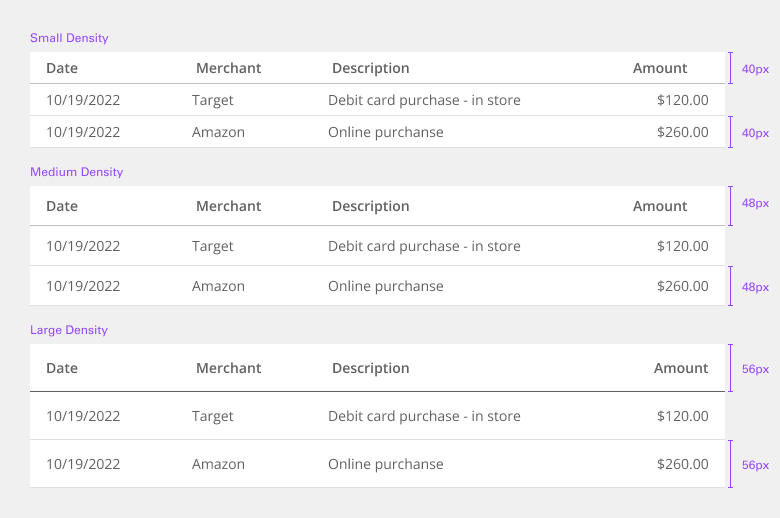

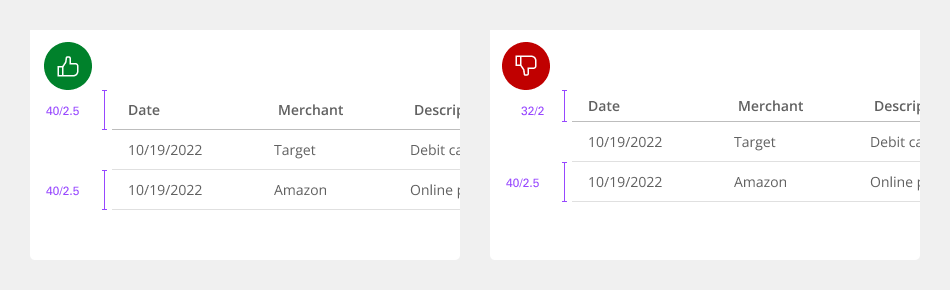

### Placement

Data tables should be placed in a page’s main content area and given plenty of space to display data without truncation. Avoid placing data tables inside modals or smaller containers where the information can feel cramped or needs truncation.

The data table can be placed on the grid following the three different grid modes outlined in the 2x grid guidelines. Although, the data table can share horizontal space with other components and content, consider giving your data table the most width on the page to help your user view dense data.

These three examples show the data table on the wide (default), narrow, and condensed grid modes. Note the different type alignments and gutter sizes.

| Density             | Purpose |
|:------------------- | :------ |
| Wide grid mode      | The wide grid mode is the default and gives the most breathing room between the data table and the other components or content. |
| Narrow grid mode    | Using the data table on a narrow grid will hang the component into the gutter and create a desirable type alignment between the data table’s title and other type on the page. |
| Condensed grid mode | The data table can be used on a condensed grid, but care should be taken to avoid any unintentional relationships with other UI elements. Use a hybrid grid or a dissimilar background color to avoid the components blending into each other. |

### Content

#### Data table title and description

- The table title should make it clear to the user what this the data has in common and what purpose it serves in the UI.
- A description can be added under the title to provide more information about the data or its source.
- A data table’s title and description should use sentence-case capitalization.

#### Column titles

- Column titles should stick to one or two words that describe the data in that column.
- In cases where a column title is too long, wrap the text to two lines and then truncate the rest of the text. The full text should be shown in a tooltip on hover.
- Column titles should use sentence-case capitalization.

### Expandable

The expandable data table helps present large amounts of data in a small space. Use the expanded section for supplementary information or data that needs additional query time. When the content in the expanded area feels cramped, consider taking the user to a dedicated page, side panel, or modal to view the information and complete tasks.

#### Batch expansion

When appropriate, a batch expansion feature can be added to the table column header to allow the user to open all collapsed sections simultaneously. However, the expand-all chevron is not shown by default in the expandable data table variant. Keeping detailed information in the expanded section saves user loading time by postponing some data queries until needed. Expanding all rows at once will typically negate this advantage of the expandable table.

### Selectable

By default, the selectable variant allows users to select more than one row in a data table simultaneously. To select a row, the user must select the checkbox associated with the row. The user can select all rows at once by selecting the checkbox in the column header. Checkboxes in the rows have only two states, checked and unchecked. However, the check all checkbox in the column header has three states, check, unchecked, and indeterminate.

#### Radio selection

The data table also supports a single-select radio button control, limiting the user to selecting only one row at a time. The radio button is placed in the first column on the left side. Single actions applied to the chosen radio item are often placed on the right side of the table toolbar area. They can manifest as primary, ghost, or icon-only buttons.

#### Expandable and selectable

Data tables can be configured to have both expandable and selectable features. The expandable icon always appears first and to the left of the selection icon.

### Universal behaviors

The data table’s toolbar and rows follow interaction conventions found in other components. Buttons, checkboxes, radio buttons, overflow menus, search, and expanding elements are used in the data table, and all behave accordingly to their guidelines.

#### Mouse

Users can trigger an action or function in the table by clicking the associated button or component. Each action or function has its own distinct click target. See the accessibility tab for additional interactive guidance.

#### Hover

The data table’s row hover state should always be enabled as it can help the user visually scan the columns of data in a row even if the row is not interactive.

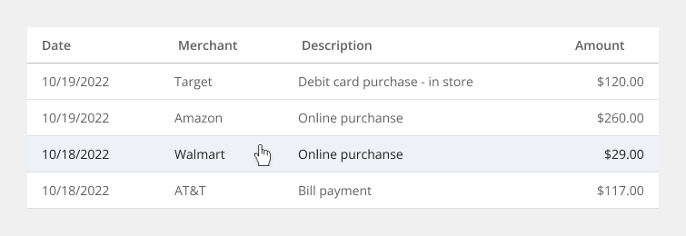

### Pagination

Pagination divides table data into separate pages. Simple pagination indicates the current page in view and offers controls to incrementally navigate to the previous or next page. Advanced pagination is accompanied by an option that enables the user to change the number of items per page and to jump to a specific page number. The pagination component is always placed at the bottom of the data table. See the pagination component for further guidelines and configurations.

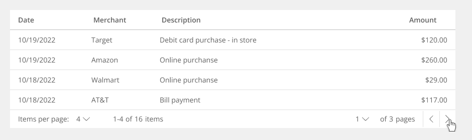

### Table toolbar

The table toolbar is reserved for global table actions such as table settings, complex filters, exporting or editing table data. Actions in the toolbar can use primary, ghost, or icon-only buttons. We recommend showing at most five actions within the table toolbar. Additional actions can be made available through an overflow menu, combo button, or similar components.

### Searching

#### Collapsed search

A search field can be triggered through an icon button in the data table toolbar. The search should be closed by default and placed below the table title.

#### Open search

The search field can appear always open on a data table. The field is placed on the left side of the table under the table title and stretches until it meets the actions on the right.

### Sorting

Columns can be sorted in ascending or descending order. Sorting controls are located in the column headers and indicated with an arrow icon on hover and when a column has been sorted.

A sorted data table has three states: unsorted (arrows), sorted-up (arrow--up) or sorted-down (arrow--down). The icon indicates the current sorted state and is only shown if sorting is activated. Only the column being sorted should display an icon, and unsorted icons are only visible on hover.

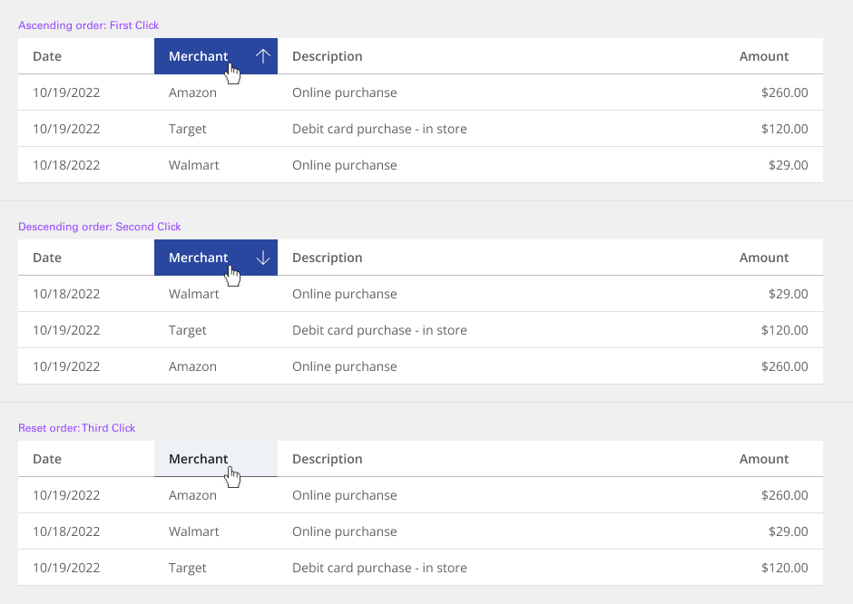

### Inline actions

Inline actions are functions that may be performed on a specific table row. Each row is accompanied by an overflow menu that contains actions related specifically to that row.

When the overflow menu contains fewer than three options, keep the actions inline as icon buttons instead. This reduces a click and makes available actions visible briefly.

### Overflow menu

By default, the overflow menu icons are persistent on each row. Having the overflow menus always visible signals to the user actions can be taken on the table rows. Alternatively, a product team may use the `overflowMenuOnHover` prop to only show the overflow menu on hover and focus to reduce the visual clutter of an overflow menu on every row.

For mobile and touch devices the data table will detect if the user agent supports hover-over and persist the overflow menus even if the `overflowMenuOnHover` prop is enabled.

### Loading

If additional load time is expected to display information, use skeleton states instead of spinners.

### Modifiers

The data table features a zebra stripes modifier that styles the table rows with alternating colors to make scanning horizontal information easier for the user.

## Style

Below is the token architecture color build of the components. The token can be changed or defined through the token mapping script that has been placed in the application repository.

### Color

**Table header (TH)**

| State                      | Element                    | Property                   | Token name                 |
| :------------------------- | :------------------------- | :------------------------- | :------------------------- |
| Enabled                    | Container                  | Background Color           | `$layer_1`                 |
|                            |                            | Border Color               | `$border_strong_1`         | 
|                            | Title                      | Text Color                 | `$text_primary`            |
|                            | Icon                       | SVG Color                  | `$icon_secondary`          |
| Hover                      | Container                  | Background Color           | `$layer_hover_1`           |
|                            |                            | Border Color               | `$border_strong_1`         | 
|                            | Title                      | Text Color                 | `$text_primary`            |
|                            | Icon                       | SVG Color                  | `$icon_secondary`          |
| Selected                   | Container                  | Background Color           | `$layer_selected_1`        |
|                            |                            | Border Color               |                            | 
|                            | Title                      | Text Color                 | `$text_on_color`           |
|                            | Icon                       | SVG Color                  | `$icon_on_color`           |
| Focus                      | Container                  | Background Color           | `$focus_highlight`         |
|                            |                            | Border Color               | `$focus`                   | 
|                            | Title                      | Text Color                 | `$text_primary`            |
|                            | Icon                       | SVG Color                  | `$icon_primary`            |
| Disabled                   | Container                  | Background Color           | `$layer_1`                 |
|                            |                            | Border Color               | `$border_strong_1`         | 
|                            | Title                      | Text Color                 | `$text_disabled`           |
|                            | Icon                       | SVG Color                  | `$icon_disabled`           |
| Error                      | Container                  | Background Color           | `$support_bg_error`        |
|                            |                            | Border Color               | `$border_strong_1`         | 
|                            | Title                      | Text Color                 | `$support_error`           |
|                            | Icon                       | SVG Color                  | `$support_error`           |

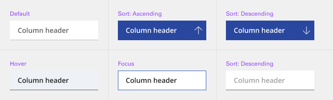

**Table row (TR)**

| State                      | Element                    | Property                   | Token name                 |
| :------------------------- | :------------------------- | :------------------------- | :------------------------- |
| Enabled                    | Container                  | Background Color           | `$layer_1`                 |
|                            |                            | Border Color               | `$border_subtle_1`         | 
|                            | Title                      | Text Color                 | `$text_primary`            |
|                            | Icon                       | SVG Color                  | `$icon_secondary`          |
| Hover                      | Container                  | Background Color           | `$layer_hover_1`           |
|                            |                            | Border Color               | `$border_subtle_1`         | 
|                            | Title                      | Text Color                 | `$text_primary`            |
|                            | Icon                       | SVG Color                  | `$icon_secondary`          |
| Selected                   | Container                  | Background Color           | `$layer_selected_1`        |
|                            |                            | Border Color               |                            | 
|                            | Title                      | Text Color                 | `$text_on_color`           |
|                            | Icon                       | SVG Color                  | `$icon_on_color`           |
| Focus                      | Container                  | Background Color           | `$focus_highlight`         |
|                            |                            | Border Color               | `$focus`                   | 
|                            | Title                      | Text Color                 | `$text_primary`            |
|                            | Icon                       | SVG Color                  | `$icon_primary`            |
| Disabled                   | Container                  | Background Color           | `$layer_1`                 |
|                            |                            | Border Color               | `$border_subtle_1`         | 
|                            | Title                      | Text Color                 | `$text_disabled`           |
|                            | Icon                       | SVG Color                  | `$icon_disabled`           |
| Error                      | Container                  | Background Color           | `$support_bg_error`        |
|                            |                            | Border Color               | `$border_subtle_1`         | 
|                            | Title                      | Text Color                 | `$support_error`           |
|                            | Icon                       | SVG Color                  | `$support_error`           |

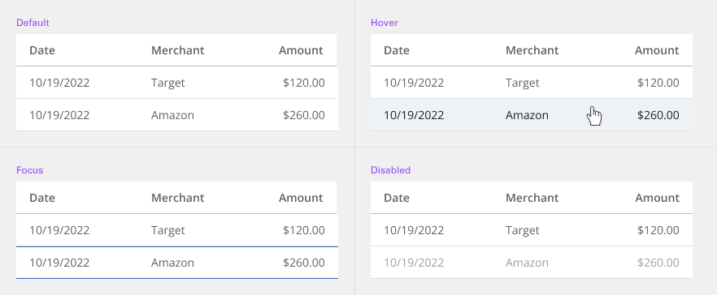

### Typography

| State      | Element         | Font size | Font weight | Token name                |
| ---------- | --------------- | --------- | ----------- | ------------------------- | 
| Small      | Header title    | 14px      | 700 bold    | `$body_1_compact_bold`    |
|            | Row data        | 14px      | 400 regular | `$body_1_compact_regular` |
| Medium     | Header title    | 14px      | 700 bold    | `$body_1_compact_bold`    |
|            | Row data        | 14px      | 400 regular | `$body_1_compact_regular` |
| Large      | Header title    | 16px      | 700 bold    | `$body_2_compact_bold`    |
|            | Row data        | 16px      | 400 regular | `$body_2_compact_regular` |

### Token Architecture

| Token name                  | Description                                            |
| :-------------------------- | :----------------------------------------------------- |
| `$table_small`              | Defines height for the **small** variant.              |
| `$table_medium`             | Defines height for the **medium** variant.             |
| `$table_large`              | Defines height for the **large** variant.              |
| `$table_padding`            | Defines **padding** for the component.                 |
| `$table_margin`             | Defines **margin** for the component.                  |
| `$table_border`             | Defines **border** weight for the accordion component. |
| `$table_border_radius`      | Defines **border radius** for the component.           |

### Structure

Tables are a configurable and customizable component. Designers can pick and choose certain elements and interactions. The basic table style is the required base from which tables can be developed. Basic tables are composed of a header row followed by rows of data below.

**Table**

| Element               | Property                | Size      | Token name                  |
| :-------------------- | :---------------------- | :-------- | :-------------------------- |
| Container             | Padding Right x Left    |           |                             |
|                       | Padding Top x Bottom    |           |                             |
|                       | Border Radius           | 4px       | `$table_border_radius`      |

**Table header (TH)**

| Element               | Property                | Size      | Token name                  |
| :-------------------- | :---------------------- | :-------- | :-------------------------- |
| Container             | Padding Right x Left    | 16px      | `$table_padding`            |
|                       | Border Bottom           | 1px       | `$table_border`             |
| Icon (Right)          | Margin Left             | 8px       | `$table_margin`             |
| Icon (Left)           | Margin Right            | 8px       | `$table_margin`             |

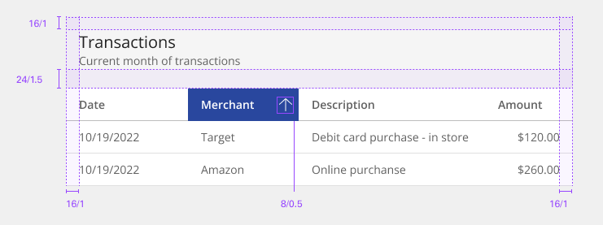

**Table row (TR)**

| Element               | Property                | Size      | Token name                  |
| :-------------------- | :---------------------- | :-------- | :-------------------------- |
| Container             | Padding Right x Left    | 16px      | `$table_padding`            |
|                       | Border Bottom           | 1px       | `$table_border`             |
| Icon (Right)          | Margin Left             | 8px       | `$table_margin`             |
| Icon (Left)           | Margin Right            | 8px       | `$table_margin`             |

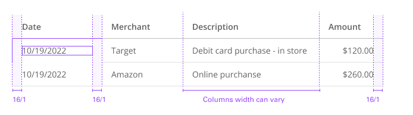

**Table row expandable (TR)**

| Element               | Property                | Size      | Token name                  |
| :-------------------- | :---------------------- | :-------- | :-------------------------- |
| Container             | Padding Right x Left    | 16px      | `$table_padding`            |
|                       | Border Bottom           |           |                             |
| Icon (Right)          | Margin Left             | 8px       | `$table_margin`             |
| Icon (Left)           | Margin Right            | 8px       | `$table_margin`             |

### Size

Row sizes are customizable. The column header row should always match the row size of the table. Column header and row text is always centered in the row apart from the extra-large which is offset by padding-top: 16px. Extra-large row heights are only recommended if your data is expected to have two lines of content in a single row.

| Size    | Element               |  Size     | Token name                 |
| :------ | :-------------------- | :-------- | :------------------------- |
| Small   | Container             | 40px      | `$table_small`             |
|         | Icon                  | 20px      | `$icon_small`              |
| Medium  | Container             | 48px      | `$table_medium`            |
|         | Icon                  | 24px      | `$icon_medium`             |
| Large   | Container             | 56px      | `$table_large`             |
|         | Content Switcher      | 28px      | `$icon_large`              |

### Enhancements

After the simple table structure, tables can be enhanced by adding any of the following: selectable rows, expanding rows, row menus, table batch actions, overall table menu, and/or table filter.

| Element               | Property                | Size      | Token name                  |
| :-------------------- | :---------------------- | :-------- | :-------------------------- |
| Checkbox              | Height x Width          | 20px      | `$checkbox_medium`          |
|                       | Padding Right x Left    | 16px      | `$table_padding`            |
| Radio                 | Height x Width          | 20px      | `$radio_medium`             |
|                       | Padding Right x Left    | 16px      | `$table_padding`            |
| Overflow Menu         | Height                  | 24px      | `$icon_medium`              |
| Chevron               | Height x Width          | 24px      | `$icon_medium`              |
|                       | Padding Right x Left    | 16px      | `$table_padding`            |
| Expanded Row/Panel    | Padding Right x Left    | 16px      | `$table_padding`            |
|                       | Padding Top x Bottom    | 16px      | `$table_padding`            |

### Toolbar

The large 48px toolbar is paired with the extra-large and large row sizes. The small toolbar is paired with the small and extra small row sizes.

| Size                  | Property                | Size      | Token name                  |
| :-------------------- | :---------------------- | :-------- | :-------------------------- |
| Large                 | Height x Width          | 48px      |                             |
|                       | Margin Top x Bottom     | 16px      | `$spacing_16`               |
| Small                 | Height x Width          | 32px      |                             |
|                       | Margin Top x Bottom     | 16px      | `$spacing_16`               |

## Accessibility

The component bakes keyboard operation into its components, improving the experience of blind users and others who operate via the keyboard. The component incorporates many other accessibility considerations, some of which are described below.

### Keyboard interaction

There are three data table variants with different interactions. Optional features like column sorting can appear in any of the variants. Table pagination is treated as a separate component. For sortable tables, the column headers are reachable by Tab and sortable with Space or Enter.

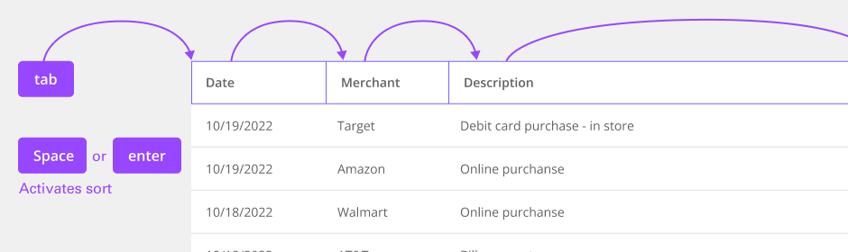

### Controls inside table

Any interactive controls in data cells are in the tab order and maintain normal keyboard operation. This also applies to expandable table rows, which operate in the same manner as accordions. Links, inputs, and other interactive controls inside tables operate by keyboard as normal.

### Labeling and updates

If columns are sortable, the sort symbols appear on hover or focus. A sorted column retains an indicator until it is no longer sorted. Sort indicators appear on hover and focus. A sorted column is indicated visually.

### Design recommendations

Since there is no persistent visual indicator that a table is sortable, designers need to annotate if a table should be implemented with sortable column headers.

### Development considerations

Keep this in mind if you are modifying the component or creating a custom component:

- Column sorting indicators are matched programmatically using aria-sort.
- Remember to supply an aria-label, aria-labelledby or title to the Table component to comply with [accessible naming](https://able.ibm.com/rules/archives/latest/doc/en-US/aria_accessiblename_exists.html).
- See the [ARIA authoring practices](https://www.w3.org/TR/wai-aria-practices-1.2/#table) for more considerations.
