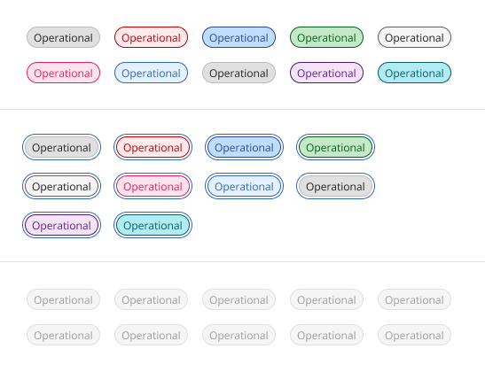
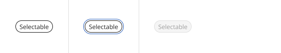

**[Back](components.md)** | **[Storybook](https://dev.dxo.ondotcloud.com/storybook-static/index.html?path=/story/pixel-components-tag--simple-default-medium)**

# Tag

Tags are categorization mechanism when dealing with vast and diverse content and user engagement is high. Tags are also used as shortcuts to the mapped/grouped contents.

## Usage

Multiple or single tags can be used to categorize items. Use short labels for easy scanning. Use two words only if necessary to describe the status and differentiate it from other tags.

### When to use

- Use tags when content is mapped to multiple categories, and the user needs a way to differentiate between them.
- Tags can also be used as a method of filtering data, to show only items within that category.

### When not to use

- When a more complex display of the data or interactions are required.
- As a replacement for a spreadsheet application.
- Do not use tags as links that direct you to an entirely different page or launch you from a current experience to a separate tab.
- Avoid using tags with multiple functions to prevent confusion and reduce accidental clicks.

### Variants

| Variant      | Purpose |
|:------------ | :------ |
| Read-only    | Tags that have no interactive functionality and are commonly used for categorizing and labeling. |
| Dismissible  | Tags that can be dismissed, closed, or removed. These tags are typically used for filtering and creating user-generated content. |
| Selectable   | Tags that can be selected or deselected and are frequently used as selections that filter data in the context of a page. They also can be used in chat flows to make decisions to advance the chat. |
| Operational  | When interacted with, these tags can disclose additional or overflow tags, like in a toggle tip, popover, modal, or breadcrumb detail view. |

### Anatomy

**Read-only tag**
1. Decorative icon (optional)
2. Title
3. Container

**Dismissible tag**
1. Decorative icon (optional)
2. Title
3. Container
4. Close icon

**Selectable tag**
1. Decorative icon (optional)
2. Title
3. Container
4. Border

**Operational tag**
1. Decorative icon (optional)
2. Title
3. Container
4. Border

### Size

There are three different tag sizes — small, medium, and large. Use small tags in condensed or inline spaces. The medium tag size is the default size and is most used. Use large tags when they are used as a primary task of the page or focal point, when you have more screen real estate at your disposal, or if the tag lives near other components that are also 32px in height.

### Placement
Vertically align the tag’s container to the other components or text near it. Do not hang tag containers into grid gutters to vertically align the tag’s titles with other text on the page. When tags are placed in groups, it is recommended to have 8px of space between them on the top, bottom, left, and right.

### Content

#### Title

- Tag titles should be concise and informative.
- Tag titles should describe the tag in a few words or be under 20 characters when possible.
- Only include long title content in tags, when necessary, for instance, when there are user-defined names of categories, system-generated strings of text, etc.

#### Overflow content

When the tag’s title is too long to fit within the available space of the tag container, the title can be truncated with an ellipsis. By mouse, the full title is disclosed in a browser tooltip on hover. By keyboard, the full title is disclosed on focus in a tooltip. Truncation should be set at the title’s start, middle, or end, depending on what is best for the given use case.

Avoid having long tag titles wrap to multiple lines within the tag container. This can construe the shape of the tag and integrity of a traditional tag shape, which should be compact in form. It can also create misalignment with other tags if they are placed within a group.

### Universal behavior

#### States

The four tag variants have different states:

- **Read-only tags** - enabled, disabled, and skeleton.
- **Dismissible tags and operational tags** - enabled, hover, focus, on click, disabled, and skeleton.
- **Selectable tags** - enabled, hover, focus, selected, disabled, and skeleton.

| State     | When to use |
|:--------- | :------ |
| Enabled   | When a tag is live, but a user is not directly interacting with it. This is commonly referred to as the default or normal state of the component. |
| Hover     | When a user is hovering over the tag with the mouse cursor to interact with it (except read-only tags). |
| Focus     | When a user selects tab or clicks on the tag, it becomes focused, indicating the user has successfully navigated to the component (except read-only tags). |
| On click  | When a user selects enter, space, or clicks on the tag to either dismiss it or disclose a list of additional tags. |
| Selected  | When user selects enter, space, or clicks on the tag to select it or deselect it. |
| Disabled  | When a user is not allowed to interact with the tag due to either permissions, dependencies, or pre-requisites. The disabled state completely removes the interactive function from a component. The styling is not subject to WCAG contrast compliance. |

#### Mouse

- **Read-only tags** - Do not get mouse functionality besides a mouse cursor on hover and do not have interactive functionality.
- **Dismissible tags** - Receive a mouse cursor when hovering over the title area of the tag. When hovering over the close icon, the icon gets a background color change and a mouse pointer. Once the close icon area is clicked, the tag will be dismissed, closed, or removed.
- **Selectable tags** - Receive a full background color change and mouse pointer on hover. Clicking anywhere on the tag will put it in a selected state. Once in the selected state, clicking anywhere on the tag again will deselect it.
- **Operational tags** - Receive a background color change and mouse pointer on hover. Clicking anywhere on the tag will disclose a way of viewing more related tags in either a toggle tip, popover, modal, or breadcrumb view.

#### Keyboard

- **Read-only tags** - Can not be operated by a keyboard and have no interactive functionality.
- **Dismissible tags** - Receive focus on the close icon area by pressing the Tab key. Pressing the Enter or Space keys will dismiss, close, or remove the tag.
- **Selectable tags** - The container receives focus by pressing the Tab key. Pressing the Enter or Space keys will select or deselect the tag. If navigating in a group of tags, use the Tab key to move focus to different tags in the group.
- **Operational tags** - The container receives focus by pressing the Tab key. Pressing the Enter or Space keys will disclose additional related tags, in a toggle tip, popover, modal, or breadcrumb view.

#### Clickable areas

Read-only tags are not clickable and cannot be interacted with. Dismissible tags have a clickable area around the close icon to dismiss or close the tag. Selectable and operational tags containers are clickable to either select the tag or view more tags.

### Read-only tag

Read-only tags are used to categorize, are used for labeling, and do not have interactive functionality. Read-only tags come in several color choices and can use optional decorative icons to delineate between multiple categories.

If your design intends to use tags as labels or for categorization, use modifiers like colors or icons to help indicate this differentiation.

- Do use colors to help distinguish between different tag labels or categories for easier scanning.
- Do not use the same color for every tag if they are supposed to be used as labels or categories.

### Dismissible tag

Dismissible tags allow users to dismiss, close, or remove a tag. Dismissible tags are commonly used with the search component to search or filter keywords on a page or within sections of a page.

Dismissible tags can also be used as user-generated labels that are applied to instances and can be removed later if needed. Do not use a dismissible tag if the intention for it is to always remain persistent since they can be closed or dismissed by the user.

### Selectable tag

Selectable tags give users the ability to select or deselect them. They can be used in a form containing only tags as the selection method, in a chat to make decisions and forward the chat, and can be used as selections to filter content on a page or within a component.

In some cases, selectable tags can be used as an alternative to traditional form components when the entire form consistently uses tags as its form selection style. Selectable tags should always remain in high contrast to ensure a noticeable difference between selected and unselected tags.

When selectable tags are in groups, we recommend using horizontal alignment for easier scanning when there are only a few tags. Keep groups of tags horizontally on one line when there are six tags or less. Horizontal alignment is not recommended when there are many tags to select from in a group. Tags should wrap to form another line if there are too many to arrange horizontally on one line. If the number of tags exceeds five lines of wrapping, consider using a different component for your use case, like a multi-select dropdown.

- Do wrap tags in a group to a few multiple lines.
- Do not wrap tags in a group of more than five lines.

### Operational tag

Operational tags enable the user to see a more comprehensive view of all tags disclosed in a toggle tip, popover, or breadcrumb detail view. Do not use tags as links that direct you to an entirely different page or launch you from a current experience to a separate tab.

### Modifiers

#### Decorative icons

Decorative icons lead before the tag title. Decorative icons are optional and are often used to support the tag title visually. We recommend not using decorative icons in the small tag size where there is compact spacing, which could create possible visual tension between some icon shapes and tags with borders.

#### Tag colors

Read-only, dismissible, and operational tags come in a variety of different colors, with values from the defined color palette using component tokens. It is recommended to use multiple colors to denote different categories or labels. Selectable tags are unavailable in these colors; instead, they use core tokens.

#### AI presence

Tag has a modification that embeds the AI label when AI is present in the component. The AI variants function the same as the normal versions except with the addition of the inline AI label which is both a visual indicator and the trigger for the explainability popover.

## Style

### Color

Below is the token architecture color build of the components. The token can be changed or defined through the token mapping script that has been placed in the application repository.

Read-only, dismissible, and operational variants of tag use component tokens with values from the [color palette](../guidelines/color.md). Light themes use step 70 for text and icons, step 40 for borders, and step 20 for backgrounds. Dark themes use step 20 for text and icons, step 50 for borders, and step 70 for backgrounds. The only exception where core tokens are used are in high contrast and outline styles.

The selectable tag variant only uses core tokens and does not use component tokens.

| Variant             | Color                | Element              | Property             | Token name           |
| :------------------ | :------------------  | :------------------  | :------------------  | :------------------  |
| Read-only           | All colors           | Container            | Background Color     | See color palette    |
|                     |                      | Text                 | Text Color           | See color palette    |
|                     |                      | Icon                 | SVG Color            | See color palette    |
|                     | Outline              | Container            | Background Color     | `$background `       |
|                     |                      | Border               | Border Color         | `$border_strong_1`   |
|                     |                      | Text                 | Text Color           | `$text_primary `     |
|                     |                      | Icon                 | SVG Color            | `$icon_primary `     |
| Dismissible tag     | All colors           | Container            | Background Color     | See color palette    |
|                     |                      | Text                 | Text Color           | See color palette    |
|                     |                      | Icon                 | SVG Color            | See color palette    |
|                     | Outline              | Container            | Background Color     | `$background`        |
|                     |                      | Border               | Border Color         | `$border_strong_1`   |
|                     |                      | Text                 | Text Color           | `$text_primary`      |
|                     |                      | Icon                 | SVG Color            | `$icon_primary`      |
| Operational tag     | All colors           | Container            | Background Color     | See color palette    |
|                     |                      | Text                 | Text Color           | See color palette    |
|                     |                      | Icon                 | SVG Color            | See color palette    |
| Selectable tag      |                      | Container            | Background Color     | `$layer_1`           |
|                     |                      | Border               | Border Color         | `$border_strong_1`   |
|                     |                      | Text                 | Text Color           | `$text_primary `     |
|                     |                      | Icon                 | SVG Color            | `$icon_primary`      |

#### Read-only tag colors

#### Dismissible tag colors

#### Operational tag colors

#### Selectable tag colors

| Variant             | Color                | State                | Element              | Property             | Token name           |
| :------------------ | :------------------  | :------------------  | :------------------  | :------------------  | :------------------  |
| Dismissible tag     | All colors           | Hover                | Container            | Background Color     | See color palette    |
|                     |                      | Focus                | Border               | Border Color         | `$focus `            |
|                     |                      | Disabled             | Text                 | Text Color           | `$text_disabled`     |
|                     |                      |                      | Background           | Background Color     | `$layer_disabled_1`  |
|                     |                      |                      | Icon                 | SVG Color            | `$icon_disabled`     |
|                     | Outline              | Hover                | Container            | Background Color     | `$layer_hover_1`     |
|                     |                      | Focus                | Border               | Border Color         | `$focus`             |
|                     |                      | Disabled             | Text                 | Text Color           | `$text_disabled`     |
|                     |                      |                      | Background           | Background Color     | `$layer_disabled_1`  |
|                     |                      |                      | Border               | Border Color         | `$border_disabled_1` |
|                     |                      |                      | Icon                 | SVG Color            | `$icon_disabled`     |
| Operational tag     | All colors           | Hover                | Container            | Background Color     | See color palette    |
|                     |                      | Focus                | Border               | Border Color         | `$focus`             |
|                     |                      | Disabled             | Text                 | Text Color           | `$text_disabled`     |
|                     |                      |                      | Background           | Background Color     | `$layer_disabled_1`  |
|                     |                      |                      | Icon                 | SVG Color            | `$icon_disabled`     |
| Selectable tag      |                      | Hover                | Container            | Background Color     | `$layer_hover_1`     |
|                     |                      | Focus                | Border               | Border Color         | `$focus`             |
|                     |                      | Disabled             | Text                 | Text Color           | `$text_disabled `    |
|                     |                      |                      | Background           | Background Color     | `$layer_disabled_1`  |
|                     |                      |                      | Icon                 | SVG Color            | `$icon_disabled`     |

#### Dismissible tag colors

#### Operational tag colors

#### Selectable tag colors

### Typography

Tag titles should be concise and describe the tag in a few words or be under 20 characters when possible. Only include long title content in tags, when necessary, for instance, for user-defined names or system-generated strings of text.

| State      | Element         | Font size | Font weight | Token name                |
| :--------- | :-------------- | :-------- | :---------- | :------------------------ | 
| X-small    | Label           | 10px      | 400 regular | `$h8_compact_regular`     |
| Small      | Label           | 12px      | 400 regular | `$h7_compact_regular`     |
| Medium     | Label           | 14px      | 400 regular | `$h6_compact_regular`     |
| Large      | Label           | 16px      | 400 regular | `$h5_compact_regular`     |
| X-large    | Label           | 20px      | 400 regular | `$h4_compact_regular`     |

### Token Architecture

| Token name                 | Description                                            |
| :------------------------- | :----------------------------------------------------- |
| `$tag_x_large`             | Defines height for the **x-large** variant.            |
| `$tag_large`               | Defines height for the **large** variant.              |
| `$tag_medium`              | Defines height for the **medium** variant.             |
| `$tag_small`               | Defines height for the **small** variant.              |
| `$tag_x_small`             | Defines height for the **x-small** variant.            |
| `$tag_padding`             | Defines **padding** for the component.                 |
| `$tag_margin`              | Defines **margin** for the component.                  |
| `$tag_border`              | Defines **border** weight for the accordion component. |
| `$tag_border_radius`       | Defines **border radius** for the component.           |

### Structure

 All tags have the same height. However, the width of tags varies based on the amount of content.

 | Size                 | Element               | Property                | Size      | Token name                 |
| :--------------------| :-------------------- | :---------------------- | :-------- | :-------------------------- |
| Small                | Container             | Padding Right x Left    | 8px       | `$spacing_8`                |
|                      |                       | Border Radius           | 100px     | `$tag_border_radius`        |
|                      | Icon (Decorative)     | Margin Right            | 4px       | `$spacing_4`                |
|                      |                       | Padding Left            | 4px       | `$spacing_4`                |
|                      | Icon (Dismissible)    | Margin Left             | 4px       | `$spacing_4`                |
|                      |                       | Padding Right           | 4px       | `$spacing_4`                |
|                      | Border (Operational)  | Border                  | 1px       | `$tag_border`               |
| Medium               | Container             | Padding Right x Left    | 8px       | `$spacing_8`                |
|                      |                       | Border Radius           | 100px     | `$tag_border_radius`        |
|                      | Icon (Decorative)     | Margin Right            | 4px       | `$spacing_4`                |
|                      |                       | Padding Left            | 4px       | `$spacing_4`                |
|                      | Icon (Dismissible)    | Margin Left             | 4px       | `$spacing_4`                |
|                      |                       | Padding Right           | 4px       | `$spacing_4`                |
|                      | Border (Operational)  | Border                  | 1px       | `$tag_border`               |
| Large                | Container             | Padding Right x Left    | 12px      | `$spacing_12`               |
|                      |                       | Border Radius           | 100px     | `$tag_border_radius`        |
|                      | Icon (Decorative)     | Margin Right            | 8px       | `$spacing_8`                |
|                      |                       | Padding Left            | 8px       | `$spacing_8`                |
|                      | Icon (Dismissible)    | Margin Left             | 8px       | `$spacing_4`                |
|                      |                       | Padding Right           | 8px       | `$spacing_4`                |
|                      | Border (Operational)  | Border                  | 1px       | `$tag_border`               |

#### Read-Only

#### Dismissible

#### Operational

#### Selectable

### Size

| Size                 | Element               | Size      | Token name                  |
| :--------------------| :-------------------- | :-------- | :-------------------------- |
| Small                | Container             | 18px      | `$tag_small`                |
|                      | Icon                  | 16px      |                             |
| Medium               | Container             | 24px      | `$tag_medium`               |
|                      | Icon                  | 16px      |                             |
| Large                | Container             | 32px      | `$tag_large`                |
|                      | Icon                  | 16px      |                             |

## Accessibility

The component bakes keyboard operation into its components, improving the experience of blind users and others who operate via the keyboard. The component incorporates many other accessibility considerations, some of which are described below.

Tags are used for web content that needs to be labeled, categorized, or organized using keywords that describe them. Tags are often used as a filter where all tags are in the same color, or used when content is mapped to multiple categories, where color is used to differentiate between categories.

This component has been validated to meet the WCAG 2.0 AA and Section 508 accessibility guidelines, however changes made by the content owner can affect accessibility compliance. Be sure to review and follow the guidance in this section when updating or adding new content to this component.
 
- Be sure the tag text is clear and concise.
- Color should not be used as the only means to differentiate tag categories.
- When using custom colors be sure the minimum contrast requirements are met.
- Tags that are modified as a link to filter content should also follow the link component guidance.

### Keyboard interaction

Read-only tags are not in the tab order, are not interactive, and do not receive focus.

- Dismissible tags are in the tab order and receive focus around the close icon. Pressing Enter or Space will dismiss the tag. Tabbing away from the tag will move focus to the next element in the tab order.
- Selectable tags are in the tab order and focus is shown around each tag. Pressing Enter or Space toggles the selection on and off.
- Operational tags are in the tab order and focus is shown around each tag. Pressing Enter or Space will disclose additional related tags.

### Design recommendations

Design annotations are not needed, but keep the following point in mind.

When the tag’s title is too long to fit within the available space of the tag container, the title can be truncated with an ellipsis. By mouse, the full title is disclosed in a browser tooltip on hover. By keyboard, the full title is disclosed on focus in a tooltip. Truncation should be set at the title’s start, middle, or end, depending on what is best for the given use case.

### Developer considerations

Keep this in mind if you’re modifying the component or creating a custom component.

- Do not add an onClick functionality to the dismissible tag, and only reserve interactions for the close icon in the tag.
- Do not nest buttons within the operational tag. Consider using the as prop to change an element tag to avoid nesting buttons.

